# Domestic Violence Helplines by Country

## Algeria

1. **National Line for women in distress**
   - [More Info](https://www.facebook.com/msnfcfalger)
   - Phone: +213 23 49 98 04
1. **AVIFE- Reseau Wassila Network Helpline**
   - [More Info](https://www.facebook.com/ReseauWassila/?pageid=147248582012305&ftentidentifier=3959992334071225&padding=0)
   - Phone: 0560 100 105 or 0770 286 529

---

## Angola

1. **SOS Helpline MASFAMU**
   - [More Info](https://masfamu.gov.ao/ao/noticias/detalhes.php?id=51828)
   - Phone: 145 and 146 or WhatsApp: 00244 926578354
1. **CAIVVITA**
   - [More Info](https://www.facebook.com/caivvita)
   - Phone: 15015 (freephone) or 937 901 490 or 996 638 381

---

## Benin

1. **The Green Line**
   - [More Info](https://abmsbj.org/ligne-verte/?fbclid=IwAR2jheKUIBTnJxooCApbw8Zlx2DqvnGnb_M-cEZQU7SJTAH2q9n400yZQFs)
   - Phone: 7344
1. **The Beninese Child and Family Assistance Association**
   - [More Info](https://abaef.bj/)
   - Phone: +229 66 08 14 56

---

## Botswana
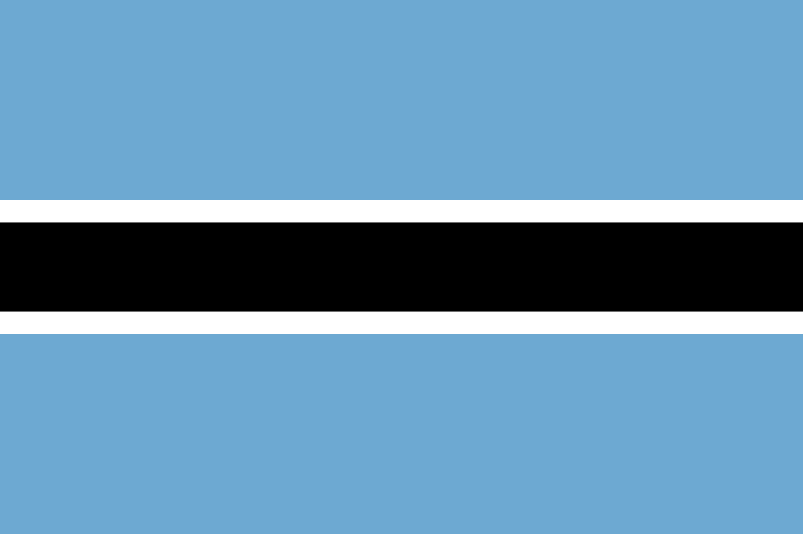

1. **Botswana GBV Prevention and Support Centre**
   - [More Info](http://bgbvc.org.bw/index.php/ame-app)
   - Phone: Gaborone: 749 568 87; 749 568 91; 742 650 81
1. **Women Against Rape**
   - [More Info](https://womenagainstrape.org.bw/get-help/)
   - Phone: 0800 600 387 or +267 71 311 244

---

## Burkina Faso

1. **Voix Des Femmes**
   - [More Info](https://www.voixdefemmes.bf/)
   - Phone: 25 50 80 64 or 25 40 21 66
1. **Gender Based Violence Helpline/Reporting Line**
   - [More Info](https://www.sig.gov.bf/details?tx_news_pi1%5Baction%5D=detail&tx_news_pi1%5Bcontroller%5D=News&tx_news_pi1%5Bnews%5D=1013&cHash=c1855e1e8af372cf829e117426cdc940)
   - Phone: 80 00 12 87

---

## Burundi

1. **Seruka Center**
   - [More Info](https://www.facebook.com/serukacentre)
   - Phone: +257 22 24 87 30
1. **SOS Women in Distress Network (SOS FED)**
   - [More Info](http://sosfed.org/)
   - Phone: +257 753 317 27

---

## Cameroon

1. **Ministry of Women and the Family Emergency Line**
   - [More Info](https://www.spm.gov.cm/site/?q=en/content/abena-ondoa-n%C3%A9e-obama-marie-th%C3%A9r%C3%A8se)
   - Phone: +237 222 23 25 50
1. **ALVF (Association for the Fight against Violence against Women)**
   - [More Info](https://www.alvf-centre.org/)
   - Phone: 985 245 1730

---

## Cape Verde

1. **VerdeFam Cabo Verde**
   - [More Info](http://www.verdefam.cv/index.php?option=com_content&view=frontpage&Itemid=54)
   - Phone: +238 261 2042 or 261 2063
1. **Gender Based Violence Emergency line**
   - [More Info](https://www.platongs.org.cv/)
   - Phone: 800 18 18

---

## Central African Republic

1. **The Association of Female Lawyers (AFJC)**
   - [More Info](https://www.peaceinsight.org/en/organisations/afjc/?location=central-african-republic&theme)
   - Phone: +236 725 414 41

---

## Chad
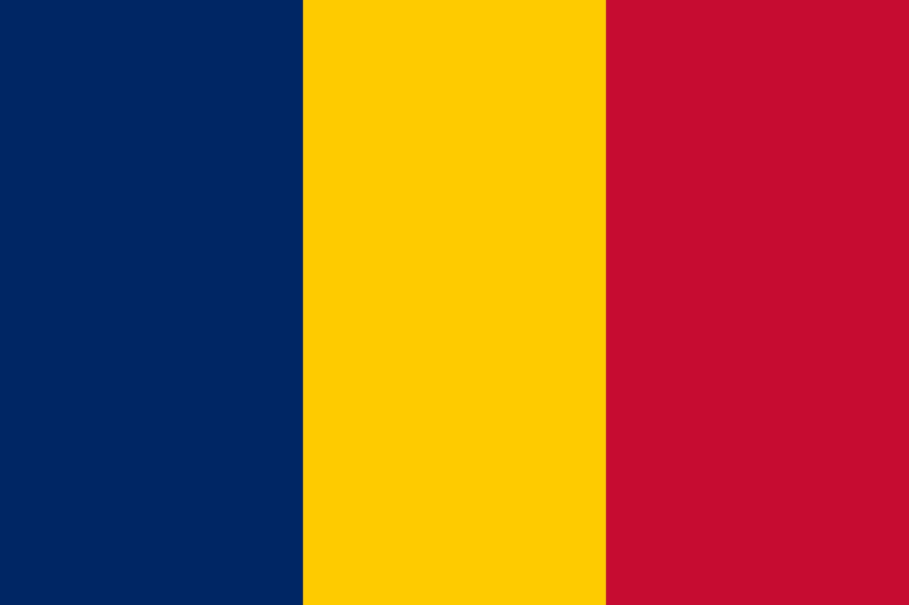

1. **Association des Femmes Juristes du Tchad (AFJT)**
   - [More Info](https://www.facebook.com/Association-des-Femmes-Juristes-du-Tchad-AFJT-354216348372830/)
   - Phone: +235 66 77 50 35
1. **Public Interest Law Center**
   - [More Info](https://www.facebook.com/pilctchad/)
   - Phone: +235 63 26 22 82 or +235 63 80 88 97

---

## Comoros

1. **ASCOBEF (Association for the good of the family)**
   - [More Info](https://www.facebook.com/Association-Comorienne-Pour-Le-Bien-Etre-De-La-Familla-Ascobef-1514140762210292/)
   - Phone: 773 5301 or 773 5351, WhatsApp: 269 323 7906

---

## Dem. Rep of Congo

1. **Synergie Des Femmes (Woman's Synergy)**
   - [More Info](https://www.facebook.com/synergiedesfemmes/)
   - Phone: +243 818 500 033
1. **AFPDE (Association of Women for the Promotion and Endogenous Development)**
   - [More Info](https://www.afpde.org/contact/)
   - Phone: +243 999 573 631

---

## Congo (Republic of)
.png)

1. **Association AZUR Development (Brazzaville)**
   - [More Info](https://www.facebook.com/Azurdev/)
   - Phone: +242 06 656 6189

---

## Djibouti
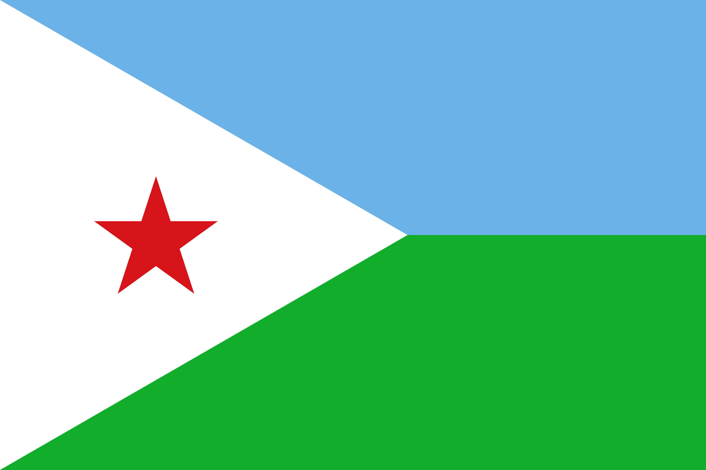

1. **Gender Based Violence Helpline**
   - [More Info](https://www.facebook.com/photo?fbid=286551288977102&set=a.235932144039017)
   - Phone: 1520
1. **Union Nationale des Femmes (National Union of Women)**
   - [More Info](https://www.facebook.com/UNFDDJIBOUTI/)
   - Phone: 21 35 04 21

---

## Egypt
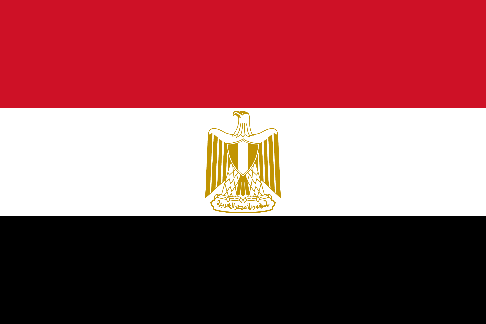

1. **National Women's Complaint Office Hotline**
   - [More Info](https://www.facebook.com/15115wco)
   - Phone: 15 115
1. **Egyptian Center for Women's Rights**
   - [More Info](https://ecwronline.org/?page_id=103&lang=ar)
   - Phone: 2527 1397 or 2528 2176

---

## Equatorial Guinea

1. **Ministry of Social Affairs and Gender Equality**
   - [More Info](https://minasig.gob.gq/violencia-de-genero/)
   - Phone: +240 333 000 000

---

## Eritrea

1. **National Union of Eritrean Women**
   - [More Info](http://www.nuew.org/)
   - Phone: 291 1 124575 or 291 1 119304

---

## Eswatini

1. **SWAGGA (Swaziland Action Group Against Abuse) Helpline**
   - [More Info](https://www.swagaa.org.sz/)
   - Phone: 2505 2899 or 2505 7514

---

## Ethiopia

1. **AWSAD Helpline (The Association for Women's Sanctuary and Development)**
   - [More Info](https://www.facebook.com/AWSADET/)
   - Phone: +251 116 672 290
1. **Gender Based Violence One Stop Centre at Gandhi Memorial Hospital**
   - [More Info](https://www.facebook.com/GHANDIHOSP/)
   - Phone: +251 91 072 1145

---

## Gabon

1. **National Emergency telephone for Gender Based Violence**
   - [More Info](https://en-gb.facebook.com/gabonegalite)
   - Phone: 1404

---

## Gambia
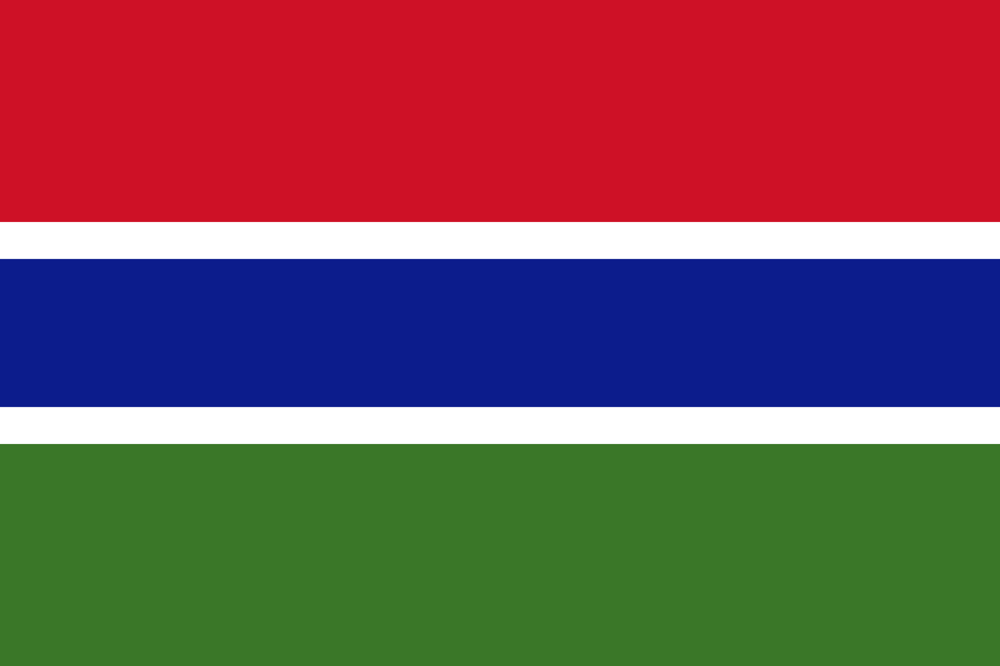

1. **National Gender-Based Violence Helpline**
   - [More Info](https://pf-initiative.org/)
   - Phone: 1313
1. **The Gambia Center for Victims of Human Rights Violations (The Victims Center)**
   - [More Info](https://www.facebook.com/VictimsofJammeh/)
   - Phone: +220 446 02 07

---

## Ghana

1. **Domestic Violence and Victims Support Unit (DOVVSU) of the Ghana Police Service Hotline**
   - [More Info](https://police.gov.gh/en/index.php/domestic-violence-victims-support-unit-dovvsu/)
   - Phone: 055 100 0900
1. **Stop Abuse Ghana**
   - [More Info](https://www.stopabuseghana.org/)
   - Phone: +233 302 522 902 or +233 501 453 666 or +233 200 184 272

---

## Guinea

1. **Association Guinéenne des Assistantes Sociales Helpline**
   - [More Info](https://www.facebook.com/people/Association-Guin%C3%A9enne-des-Assistantes-Sociales/100070299240717/)
   - Phone: 116
1. **Ministry of Women's Promotion, Children and Vulnerable People**
   - [More Info](https://www.facebook.com/MaspfeGN)
   - Phone: +224 628 21 89 94

---

## Guinea-Bissau
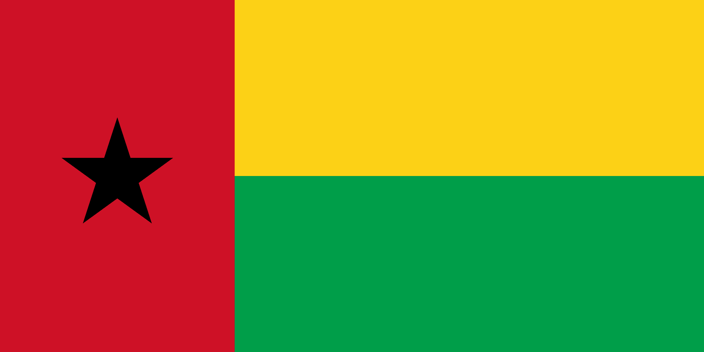

1. **RENLUV**
   - [More Info](https://www.facebook.com/renluvgb/)
   - Phone: +245 95 590 5015 or 96 6777 888 or 96 662 0207

---

## Ivory Coast

1. **24 Hours Gender Based Violence Helpline**
   - [More Info](http://www.famille.gouv.ci/public/procedures/violence-basee-sur-le-genre)
   - Phone: 1308 or 800 00 800

---

## Kenya

1. **Gender Violence Recovery Centre (GVRC) 24 Hr Emergency Line**
   - [More Info](http://gvrc.or.ke/)
   - Phone: +254 709 66 7000 or 719 63 8006
1. **Coalition on Violence Against Women (COVAW)**
   - [More Info](https://covaw.or.ke/)
   - Phone: 0800 720 553

---

## Lesotho

1. **Toll-free Helpline to report GBV cases**
   - [More Info](https://gender.gov.ls/)
   - Phone: 800 666 66
1. **She-Hive Association**
   - [More Info](https://www.shehive.co.ls/index.php)
   - Phone: +266 2231 4531 or WhatsApp: +266 5707 5354

---

## Liberia

1. **Ministry of Gender, Children & Social Protection Reporting Line**
   - [More Info](https://www.facebook.com/SweAmbLiberia/photos/pcb.150287437391875/150285190725433/)
   - Phone: 116
1. **Ministry of Gender, Children & Social Protection (office)**
   - [More Info](https://www.facebook.com/MOGCSPLiberia)
   - Phone: +231 77 780 8145

---

## Libya

1. **Gender Based Violence Helpline**
   - [More Info](https://www.facebook.com/UNFPALibya/posts/on-international-womens-day-france-announces-scaling-up-support-to-unfpas-gender/1529021480622700/)
   - Phone: 1417
1. **Women's Union Tripoli**
   - [More Info](https://www.facebook.com/%D8%A7%D9%84%D8%A7%D8%AA%D8%AD%D8%A7%D8%AF-%D8%A7%D9%84%D9%86%D8%B3%D8%A7%D8%A6%D9%8A-%D8%A7%D9%84%D9%84%D9%8A%D8%A8%D9%8A%D8%B7%D8%B1%D8%A7%D8%A8%D9%84%D8%B3-898323573530684/)
   - Phone: +218 91 702 6043

---

## Madagascar
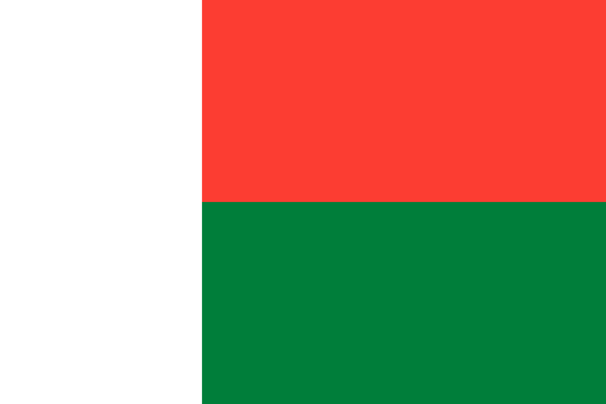

1. **Green Line**
   - [More Info](https://arozaza.mg/ligne-verte-147/)
   - Phone: 147

---

## Malawi

1. **Tithandizane GBV Crisis Line**
   - [More Info](https://www.facebook.com/tithandizanehelpline/)
   - Phone: 5600
1. **CAVWOC Helpline**
   - [More Info](https://cavwoc.org/)
   - Phone: +265 999 589 463

---

## Mali
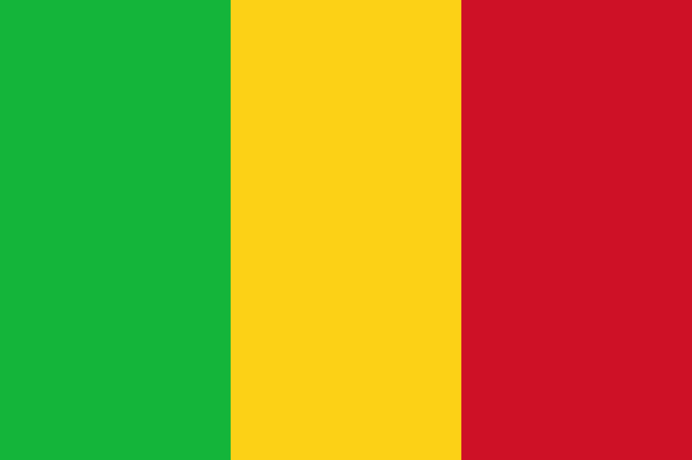

1. **VBG Green Line**
   - [More Info](https://www.facebook.com/PoliceMali/videos/553498841475808/)
   - Phone: 80 333

---

## Mauritania

1. **Green Number**
   - [More Info](http://amsme.org/)
   - Phone: 1013 or 8000 1010
1. **Ministry of Social Affairs, Childhood and Family**
   - [More Info](https://www.masef.gov.mr/spip.php?article54)
   - Phone: +222 52 58 018

---

## Mauritius

1. **SOS Femmes Hot Line**
   - [More Info](http://www.sosfemmes-mu.com/en/)
   - Phone: 233 3054
1. **Hotline 139**
   - [More Info](https://gender.govmu.org/Pages/Contact-Us.aspx)
   - Phone: 139

---

## Mayotte

1. **Association for the Status of Women and Aid to Victims**
   - [More Info](https://www.reseaux-sante-mayotte.fr/entreprise/acfav-siege-social-association-pour-la-condition-feminine-et-aide-aux-victimes)
   - Phone:  06 39 69 65 98
1. **Departmental for Women's Rights and Equality (DRDFE)**
   - [More Info](https://lannuaire.service-public.fr/mayotte/mayotte/79114d67-0497-4b24-ae79-140b618ed3a6)
   - Phone: 02 69 63 57 19

---

## Morocco

1. **National Union of Moroccan Women Helpline**
   - [More Info](http://www.unfm.ma/afficherArticle/id202003310905)
   - Phone: 8350
1. **Central support unit for women victims of violence**
   - [More Info](https://social.gov.ma/services-destines-aux-femmes/)
   - Phone: +212 537 27 6566

---

## Mozambique

1. **Linha Verde emergency hotline**
   - [More Info](https://www.facebook.com/page/131516030888583/search/?q=linha%20verde)
   - Phone: 1458
1. **Ministry of Gender, Children and Social Action**
   - [More Info](https://mgcas.gov.mz/index.php)
   - Phone: +258 21 350300 or Ce: +258 21 3042080

---

## Namibia

1. **Ministry of Health and Social Services Emergency number**
   - [More Info](https://www.facebook.com/MoHSSNamibia)
   - Phone: 0800 100 100
1. **National Crisis Child Counselling Line**
   - [More Info](https://www.lifelinechildline.org.na/background-2/)
   - Phone: +264 61 226 889

---

## Niger

1. **SOS-Femmes et Enfants Victimes de Violence Familliale (FEVVF)**
   - [More Info](https://www.facebook.com/profile.php?id=100072354343650&locale=ms_MY)
   - Phone: +227 86 06 06 06

---

## Nigeria

1. **WACOL (Womens Aid Collective) Hotline**
   - [More Info](https://www.facebook.com/profile.php?id=100010118838696&_rdc=1&_rdr)
   - Phone: 0909 133 3000, 0909 277 7000, 0906 000 2128 Whatsapp Only: 09060002128
1. **Women Safe House 24 HOUR CRISIS HOTLINE**
   - [More Info](https://www.facebook.com/womensafehouse/)
   - Phone: +234 812 113 3399

---

## Rwanda
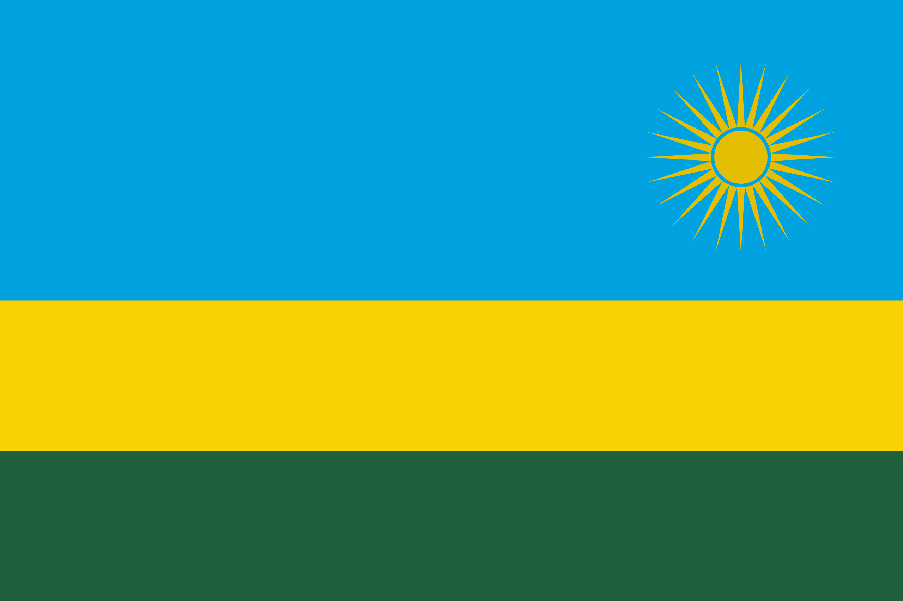

1. **Pro Femmes (For Women) Toll Free Hotline**
   - [More Info](https://www.profemmes.org/)
   - Phone: +250 788 521 600
1. **The Ministry of Gender and Family Promotion (MIGEPROF) Helpline**
   - [More Info](https://www.migeprof.gov.rw/)
   - Phone: 9059

---

## Sao Tome and Principe

1. **Sao Tomean Association of Women Lawyers**
   - [More Info](https://www.facebook.com/Associa%C3%A7%C3%A3o-S%C3%A3o-tomense-de-Mulheres-Juristas-286067801423961/)
   - Phone: +239 222 5211
1. **Platform for Human Rights and Gender Equity**
   - [More Info](https://www.facebook.com/plataformadheg.13/)
   - Phone: +239 990 9808

---

## Senegal

1. **CLVF Helpline**
   - [More Info](https://www.facebook.com/clvfsenegal)
   - Phone: 824 13 41
1. **The Siggil Jiggen network**
   - [More Info](https://siggiljigeen.wordpress.com/anglais/)
   - Phone: +221 33 825 00 56

---

## Seychelles

1. **Family Squad, Central Police Station, Victoria, Mahe**
   - [More Info](https://www.police.gov.sc/contact/directory)
   - Phone: 432 3331 or 248 8164
1. **Ministry Of Family Helpline**
   - [More Info](https://www.facebook.com/mysfseychelles/)
   - Phone: 43 97 979

---

## Sierra Leone

1. **Family Support Unit (Police Gender based violence contact)**
   - [More Info](https://www.facebook.com/www.fsu.slp.org/)
   - Phone: +232 79 042506 or +232 773 61070, +232 795 09896

---

## Somalia
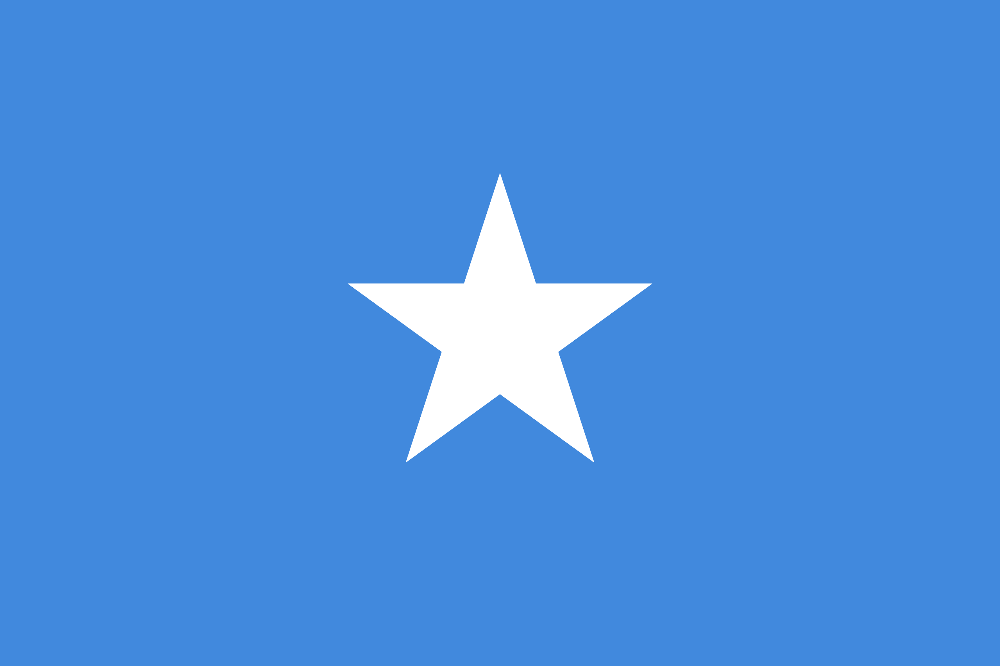

1. **GBV Crisis Center**
   - [More Info](https://sswc-som.org/)
   - Phone: +252 6153 10381

---

## South Africa

1. **24 Hours Tears Helpline**
   - [More Info](https://tears.co.za/)
   - Phone: 0800 083 277
1. **POWA (People Opposing Women Abuse)**
   - [More Info](https://www.powa.co.za/get-help/)
   - Phone: 0116 424 345/6

---

## South Sudan

1. **South Sudan Women's Empowerment Network**
   - [More Info](https://sswen.org/policy-politics/)
   - Phone: +211 954 381 716
1. **Federation of Women Lawyers**
   - [More Info](https://www.facebook.com/Federation-of-Women-Lawyers-Fida-South-Sudan-105645197785334/)
   - Phone: +211 916 657 050

---

## Sudan

1. **Siha Network**
   - [More Info](https://www.facebook.com/SIHANetwork/)
   - Phone: +256 200 906263

---

## Tanzania

1. **WLAC Toll-free Women's Abuse hotline**
   - [More Info](https://www.facebook.com/WomensLegalAidCentre/)
   - Phone: +255 22 266 4051 or 0800 780 100
1. **Police Women & Children Desk**
   - [More Info](https://www.polisi.go.tz/)
   - Phone: +255 787 668 306

---

## Togo
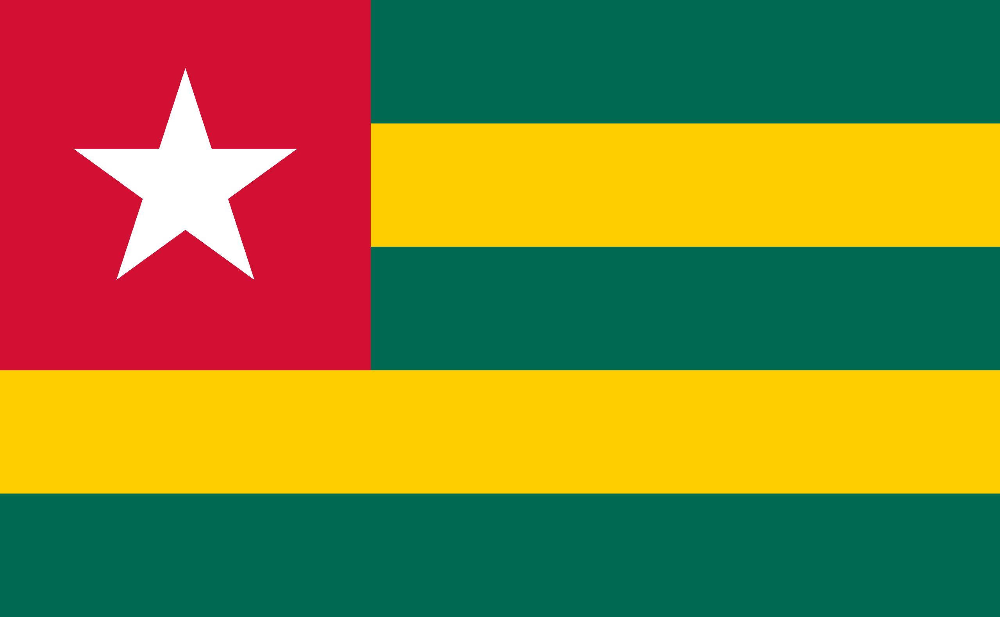

1. **Green number**
   - [More Info](https://www.espoirvietogo.org/numero-vert/)
   - Phone: 80 00 00 11
1. **Ministry of Social Action and Promotion of Women**
   - [More Info](https://www.facebook.com/MinisteredelActionSocialeetdelaPromotiondelaFemme)
   - Phone: +228 22 21 52 79

---

## Tunisia

1. **Green Line Against Violence**
   - [More Info](http://www.femmes.gov.tn/ar/2020/04/30/%d8%aa%d9%82%d8%b1%d9%8a%d8%b1-%d8%a7%d9%84%d8%ae%d8%b7-%d8%a7%d9%84%d8%a7%d8%ae%d8%b6%d8%b1-%d9%84%d9%85%d9%82%d8%a7%d9%88%d9%85%d8%a9-%d8%a7%d9%84%d8%b9%d9%86%d9%811899/)
   - Phone: 1899

---

## Uganda
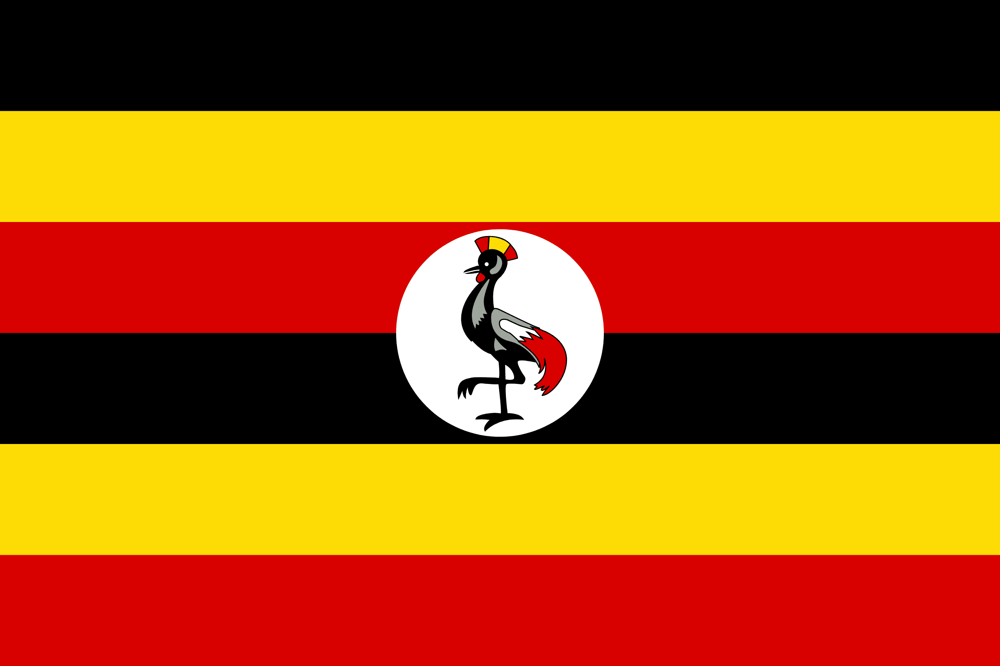

1. **Action Aid Women Protection Center (shelter)**
   - [More Info](https://uganda.actionaid.org/publications/2018/surge-project-women-gender-based-violence-shelter-project)
   - Phone: 07829 97124
1. **National Emergency Call Center (Police Headquarters)**
   - [More Info](https://www.upf.go.ug/national-emergence-toll-free-numbers-for-public-safety/)
   - Phone:  0800 199 399

---

## Zambia

1. **Lifeline Zambia GBV Helpline**
   - [More Info](https://clzambia.org/lifeline-993/)
   - Phone: 933
1. **YMCA Zambia Helpline**
   - [More Info](https://www.facebook.com/ywcazambia/)
   - Phone: +260 211 255 204

---

## Zimbabwe

1. **Anti-Domestic Violence Council**
   - [More Info](https://www.womenconnect.org/web/zimbabwe/social-services/-/asset_publisher/JQCrzqBWvNE8/content/social-services-in-zimbabwe)
   - Phone: +263 242 700095 or 708666

---

## Bahrain

1. **Women's Police**
   - [More Info](https://shamsaha.org/resources-01/)
   - Phone: 1787 0302
1. **Shamsaha 24/7 Helpline**
   - [More Info](https://shamsaha.org/)
   - Phone: English: +973 3844 7588; Arabic: +973 6671 0901

---

## Bangladesh

1. **The National Helpline Centre for Violence against Women and Children**
   - [More Info](https://www.facebook.com/nhcmowca/)
   - Phone: 109
1. **Helpline for Victims of Violence**
   - [More Info](https://mahilaparishad.org/)
   - Phone: 01717 363 647 or 01727 209 271

---

## Bhutan

1. **Woman and Child Helpline**
   - [More Info](http://ncwc.gov.bt/)
   - Phone: 1098
1. **RENEW Center**
   - [More Info](https://renew.org.bt/contact/)
   - Phone: +975 2 332159 or 334751 or +975 2 332411

---

## Brunei

1. **Brunei Welfare Hotline**
   - [More Info](http://www.japem.gov.bn/Perkhidmatan/Talian%20Kebajikan%20141.aspx)
   - Phone: 141

---

## Cambodia
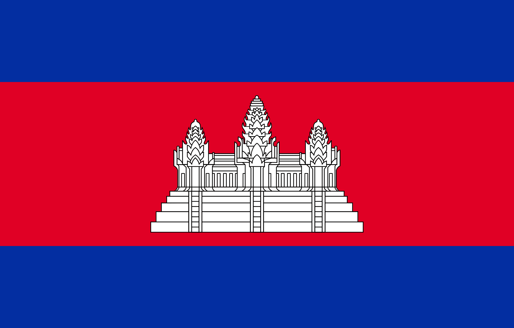

1. **Cambodia Women's Crisis Center (CWCC)**
   - [More Info](http://www.cwcc.org.kh/protection.php)
   - Phone: +855 23 997 967

---

## China

1. **Red Maple Hotline**
   - [More Info](http://www.maple.org.cn/index.php/Content/view/navno/3.html)
   - Phone: 010 6833 3388
1. **Hunan Province: Hunan Women's Federation Hotline**
   - [More Info](https://www.womenofchina.cn/womenofchina/html1/news/womeninaction/2208/5001-1.htm)
   - Phone: 0898 12338 or 0898 12345

---

## East Timor

1. **Fokupers Helpline**
   - [More Info](https://www.facebook.com/fokupers/)
   - Phone: +670 332 1534

---

## Hong Kong

1. **HKFWC's Women's Helpline**
   - [More Info](https://womencentre.org.hk/Zh/Services/counselling/womenhelpline/?fbclid=IwAR3_hc_sn44qR--hcf8XG6pIEOkRxtPQemjg7_mDh5sp5bNrPbVza2kprvc)
   - Phone:  23 86 62 55/56
1. **Harmony House 24 hour helpline**
   - [More Info](https://www.harmonyhousehk.org/chi/shelter-for-women-and-children)
   - Phone: 25 22 04 34

---

## India
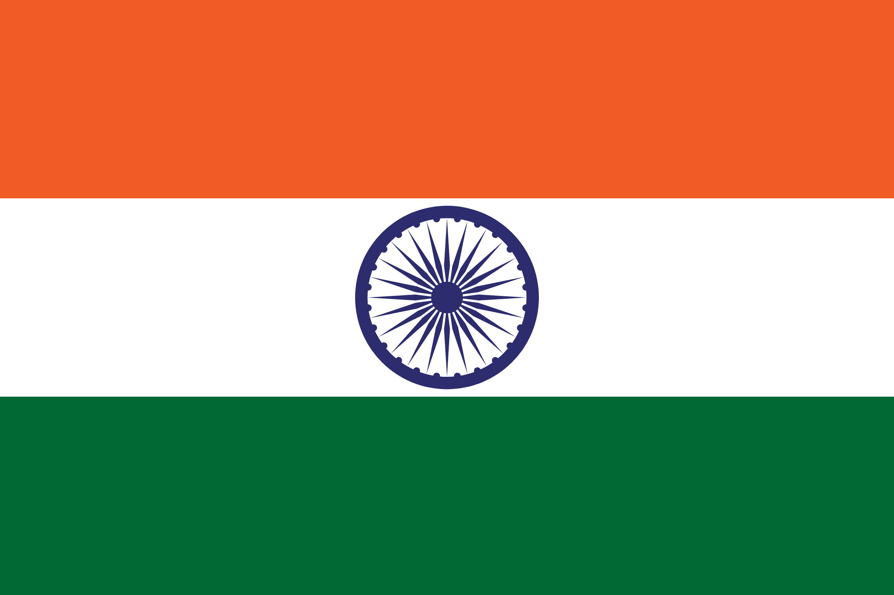

1. **National Women in Distress Helpline**
   - [More Info](http://www.ncw.nic.in/helplines)
   - Phone: 1091 and 1291
1. **Aks Foundation Gender Based Violence Crisis Line**
   - [More Info](https://aksfoundation.org/)
   - Phone: +91 8793 088 814

---

## Indonesia

1. **Ministry of Women Empowerment and Child Protection**
   - [More Info](https://www.kemenpppa.go.id/)
   - Phone: (021) 38 426 38 or 38 055 63
1. **National Commission on Violence Against Women**
   - [More Info](https://www.komnasperempuan.go.id/)
   - Phone: +62 21 390 39 63

---

## Iran

1. **Organization for Defending Victims of Violence**
   - [More Info](http://www.odvv.org/)
   - Phone: +98 (21) 88 96 30 91 or +98 (21) 88 96 49 43
1. **Social Emergency Line**
   - Phone: 123

---

## Iraq
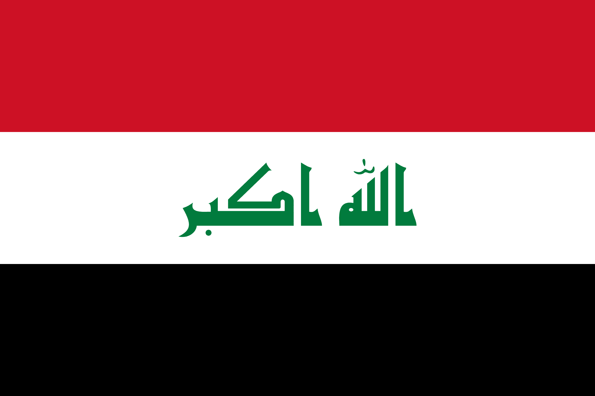

1. **Safe Lines from Baghdad Women Association**
   - [More Info](https://bwa-iraq.org/%d8%a7%d9%84%d8%ae%d8%b7%d9%88%d8%b7-%d8%a7%d9%84%d8%a7%d9%85%d9%86%d8%a9/)
   - Phone: +964 750 942 1187

---

## Israel
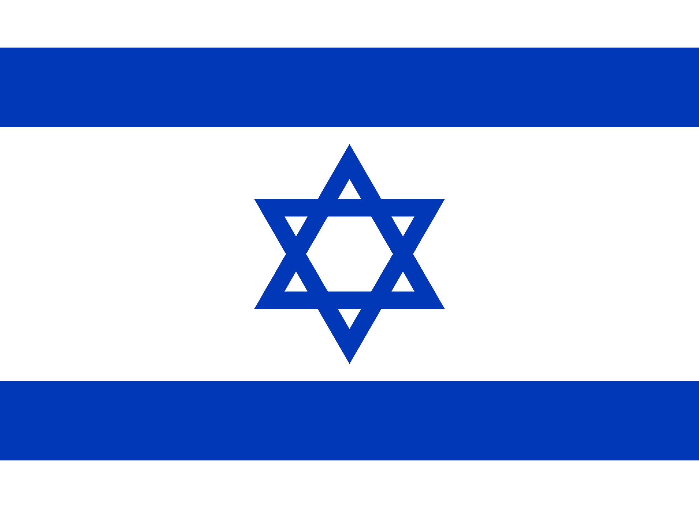

1. **National Hotline for Domestic Abuse**
   - [More Info](https://www.gov.il/he/Departments/General/molsa-domestic-violence-protection-treatment-and-rehabilitation)
   - Phone: 118
1. **Nationwide emergency DV hotline**
   - [More Info](https://www.gov.il/he/departments/israel_police/govil-landing-page)
   - Phone: 1 800 220 000

---

## Japan

1. **Domestic Abuse Helpline**
   - [More Info](https://soudanplus.jp/index.html)
   - Phone: 0120 279 889
1. **DV Helpline**
   - [More Info](https://www.gender.go.jp/policy/no_violence/dv_navi/index.html)
   - Phone: #8891

---

## Jordan
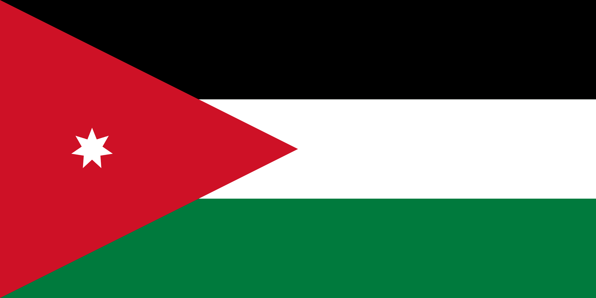

1. **Jordanian Womens Union**
   - [More Info](http://www.jwu.itgo.com/hotline.htm)
   - Phone: +962 6 5687037 or 065675729
1. **National Commission for Women**
   - [More Info](https://www.women.jo/ar)
   - Phone: +962 6 556 0741

---

## Kazakhstan
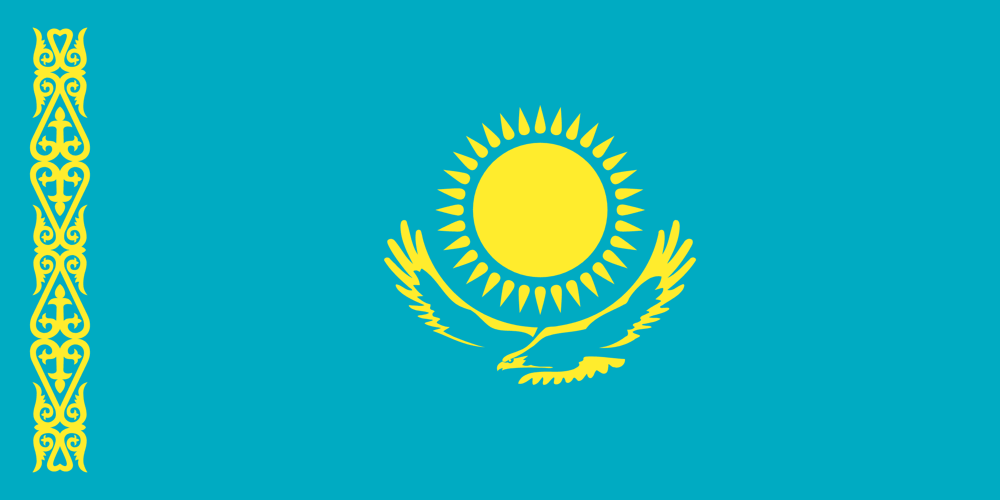

1. **National 24 Hr Helpline**
   - [More Info](https://schitaetsya.kz/crisis-centers)
   - Phone: 150 or +77081060810 (WhatsApp)

---

## Kuwait
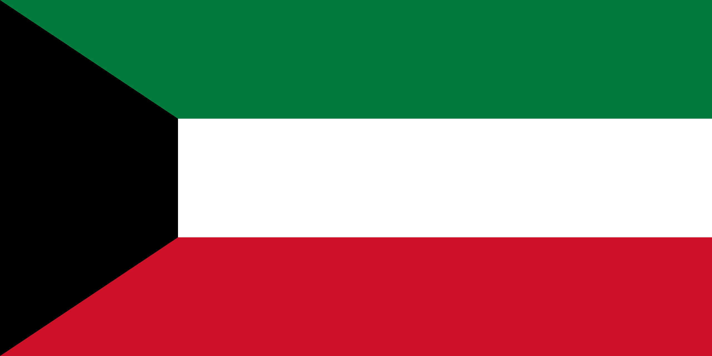

1. **Community Police Hotline**
   - [More Info](http://www.wracati.com/numbers)
   - Phone: 94948200, 94000463, 94000435

---

## Kyrgyzstan

1. **Social protection information line**
   - [More Info](https://mlsp.gov.kg/)
   - Phone: 117
1. **Women's Support Center**
   - [More Info](https://www.facebook.com/womensupportcenter1996/)
   - Phone: +996 (312) 54 74 16

---

## Lao People’s Democratic Republic

1. **Lao Women's Union**
   - [More Info](https://www.laowomenunion.org.la/)
   - Phone: 021 316253
1. **Counseling and Protection Center for Women and Children**
   - [More Info](https://www.facebook.com/UnfpaLaos/posts/2519653908064597/)
   - Phone: 1362

---

## Lebanon
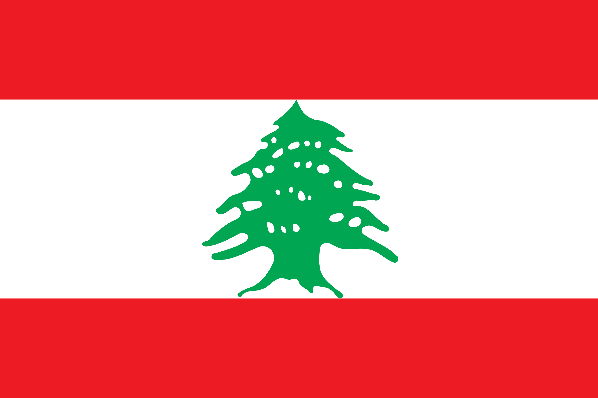

1. **Domestic Violence Helpline**
   - [More Info](https://nclw.gov.lb/en/)
   - Phone: 1745
1. **KAFA Helpline for women victims of Violence**
   - [More Info](https://kafa.org.lb/ar)
   - Phone: 03 018 019

---

## Malaysia

1. **Women's Aid Organization 24 Hrs Helpline**
   - [More Info](https://wao.org.my/getting-help-for-domestic-violence/)
   - Phone: +603 3000 8858
1. **All Women's Action Society (AWAM)**
   - [More Info](https://www.facebook.com/AWAMMalaysia/)
   - Phone: 03 78 77 42 21

---

## Maldives
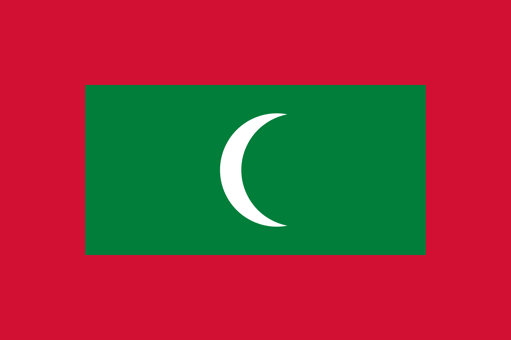

1. **Gender Ministry Abuse Hotline**
   - [More Info](http://gender.gov.mv/en/?page_id=56)
   - Phone: 1421 or 3013017

---

## Mongolia

1. **National Center Against Violence (NCAV) Advice Line**
   - [More Info](http://www.safefuture.mn/)
   - Phone: +976 7011 9949 or 96 49 05 05
1. **Victim Protection Program**
   - [More Info](https://stoptrafficking.mn/victim-protection)
   - Phone: +976 1131 1512 or +976 7011 1112

---

## Myanmar
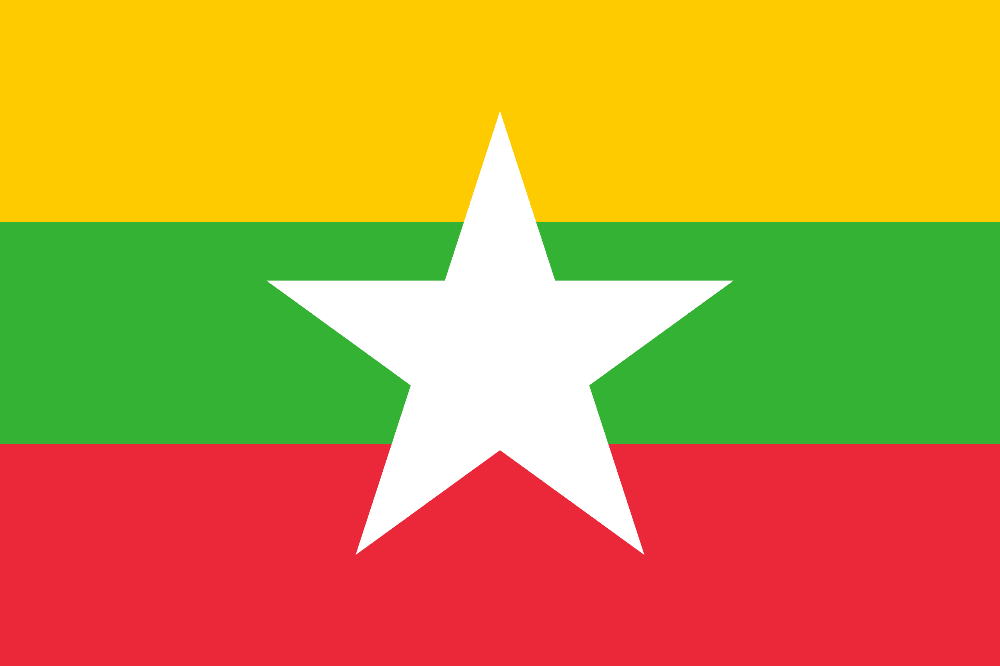

1. **Phone Khaw Lite Par helpline**
   - [More Info](https://www.facebook.com/HelpLineVAW)
   - Phone: 0978 9122 649

---

## Nepal
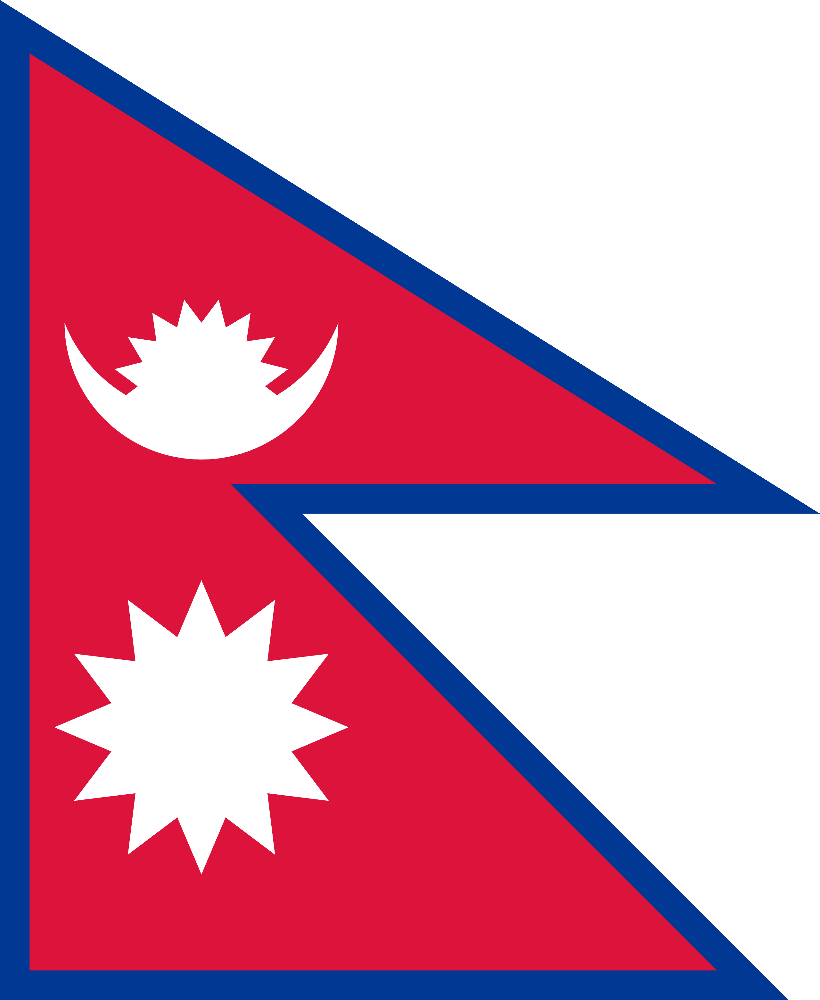

1. **WOREC (Womens Rehabilitation Center) Hotline**
   - [More Info](https://www.worecnepal.org/)
   - Phone: 166 001 789 10
1. **The Women's Foundation Nepal (WFN)**
   - [More Info](https://www.womenepal.org/)
   - Phone: +977 1 515 5160 or +977 1 515 5080

---

## Oman
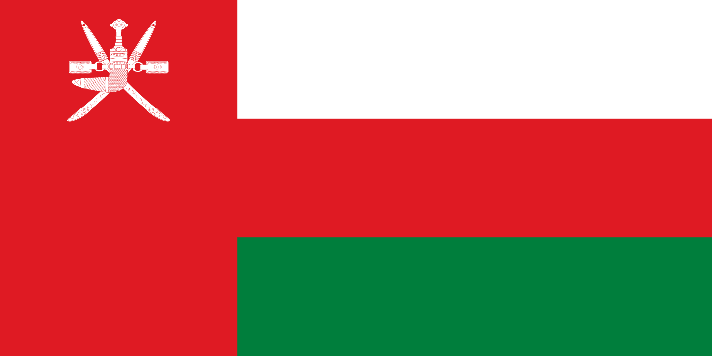

1. **Protection Hotline**
   - [More Info](https://portal.mosd.gov.om/webcenter/portal/MOSDExternalPortal/pages_contactus/locationandphonesoftheministry)
   - Phone: 1100
1. **Family Protection Department - Ministry of Social Development**
   - [More Info](https://portal.mosd.gov.om/webcenter/portal/MOSDExternalPortal/pages_contactus/locationandphonesoftheministry)
   - Phone: 800 77788

---

## Pakistan

1. **Madadgaar National Helpline**
   - [More Info](https://www.facebook.com/madadgaar1098helpline/)
   - Phone:  1098 or +92 311 6641 098 or +92 2135 685 824
1. **Ministry of Human Rights Emergency Helpline**
   - [More Info](https://mohr.gov.pk/)
   - Phone:  1099 or WhatsApp 0333 908 5709

---

## Palestine
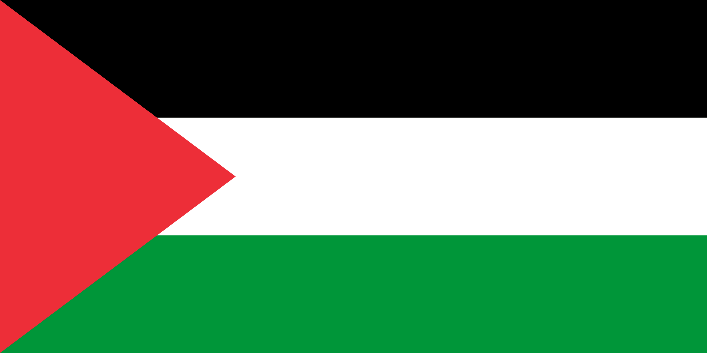

1. **ASSIWAR Emergency Hotline**
   - [More Info](https://www.facebook.com/AssiwarTheFeministArabMovement/)
   - Phone: 04 8533044

---

## Philippines

1. **Aleng Pulis Hotline**
   - [More Info](https://www.facebook.com/wcpc.didmpnp)
   - Phone: +63 919 777 7377
1. **Department of Social Welfare and Development**
   - [More Info](https://www.gov.ph/the-government/hotlines/)
   - Phone: Text to 0918 912 2813 or call (02) 8931 8101 to 07

---

## Qatar

1. **Family Guidance and Consultation Helpline**
   - [More Info](https://www.wifaq.org.qa/ar/contacts)
   - Phone: 16003

---

## Saudi Arabia

1. **Violence Against Women 24 Hour Helpline**
   - [More Info](https://hrsd.gov.sa/en/%D8%A7%D9%86%D9%81%D9%88%D8%AC%D8%B1%D8%A7%D9%81%D9%8A%D9%83/family-violence-reporting-center-1919)
   - Phone: 1919

---

## Singapore
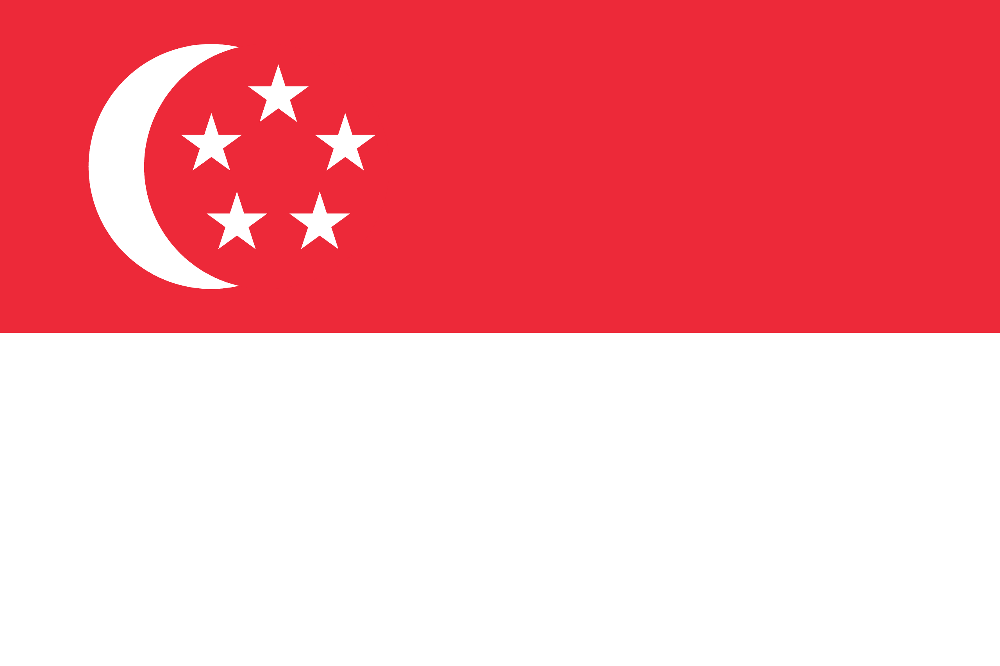

1. **National Anti-Violence Helpline**
   - [More Info](https://www.msf.gov.sg/what-we-do/break-the-silence/home)
   - Phone: 1800 777 0000
1. **Family Violence Specialist Centre**
   - [More Info](https://www.pave.org.sg/contact-us)
   - Phone: 6555 0390

---

## South Korea

1. **Korean Women's Hotline**
   - [More Info](https://hotline.or.kr/information)
   - Phone: 02 2263 6464/5

---

## Sri Lanka

1. **Women In Need (WIN) HOTLINE**
   - [More Info](https://www.winsl.net/)
   - Phone: 077 5676 555
1. **Ministry of Women & Child Affairs and Social Security 24 Hr Helpline**
   - [More Info](https://www.childwomenmin.gov.lk/en)
   - Phone: 1938

---

## Syria
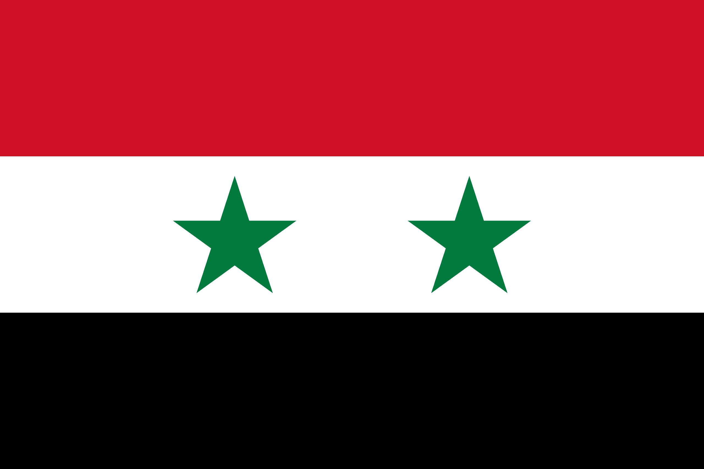

1. **Syrian Women Association (SWA)**
   - [More Info](https://www.facebook.com/turkiaswa)
   - Phone: +90 552 782 99 75

---

## Taiwan

1. **Garden of Hope Helpline**
   - [More Info](https://global.goh.org.tw/services-for-victims-of-intimate-partner-violence-domestic-abuse/)
   - Phone: 886 2 8911 5595
1. **Taipei Women's Rescue Foundation**
   - [More Info](https://www.twrf.org.tw/info/category/7)
   - Phone: 02 2555 8595

---

## Tajikistan

1. **Violence Against Women Hotline**
   - [More Info](https://www.facebook.com/profile.php?id=100069401160624&locale=ru_RU)
   - Phone: 1313

---

## Thailand

1. **Association for the Promotion of the Status of Women 24 Hr Helpline**
   - [More Info](http://www.apsw-thailand.org/kanitnaree1-th.html)
   - Phone: 02 929 2222
1. **Ministry of Social Development Hotline**
   - [More Info](https://www.m-society.go.th/home.php)
   - Phone: 1300

---

## Tibet
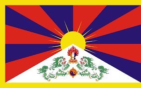

1. **Tibetan Women Helpline**
   - [More Info](https://tibet.net/women-empowerment-desk-and-twa-releases-hotline-for-sexual-and-genderbased-violence/)
   - Phone: 01892 220 120

---

## Turkey
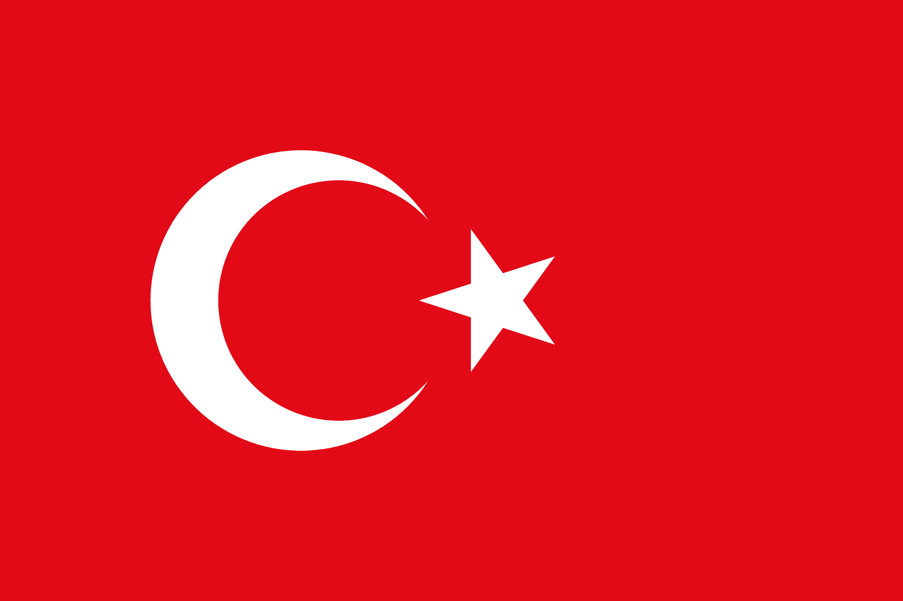

1. **Emergency Domestic Violence Hotline**
   - [More Info](https://www.tkdf.org.tr/)
   - Phone: 0212 656 96 96 or 0549 656 96 96
1. **24 Hour Support Line**
   - [More Info](https://www.csdestek.org/acil-destek-durumlari)
   - Phone: 183

---

## Turkmenistan

1. **Keik Okara Womens Line**
   - [More Info](https://turkmenistan.unfpa.org/en/news/ngo-keyik-okara-bring-critical-relief-women-amid-domestic-violence)
   - Phone: +99312 22-86-68 or +993 12 229 389

---

## United Arab Emirates

1. **Dubai Foundation for Women and Children Hotline**
   - [More Info](https://www.dfwac.ae/care-and-rehabilitation)
   - Phone: 8001 111
1. **Social Support Center Hotline**
   - [More Info](https://www.facebook.com/mocduae)
   - Phone: 024 028 263

---

## Uzbekistan
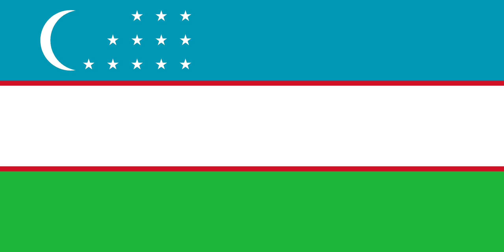

1. **Ministry for the Support of Mahalla and Family Hotline**
   - [More Info](https://uzbekistan.unfpa.org/en/news/launch-%E2%80%9C16-days-activism-against-gender-based-violence%E2%80%9D-campaign-uzbekistan)
   - Phone: 1146

---

## Vietnam

1. **Hotline for Free Consultation on Gender Violence**
   - [More Info](http://csaga.org.vn/thong-tin-to-chuc-en.html)
   - Phone: 024 3333 55 99

---

## Yemen

1. **Yemeni Women Union**
   - [More Info](https://www.facebook.com/yemenwu)
   - Phone: 8000 999
1. **Toll-Free Helpline**
   - [More Info](http://www.fcdf-ye.org/Default2.aspx)
   - Phone: 136

---

## Antigua and Barbuda

1. **24 Hour Crisis Hotline**
   - [More Info](https://genderaffairs.gov.ag/support-and-referral-centre/)
   - Phone: +268 463 55 55 or Chat on 1 268 734 4555

---

## Argentina

1. **Family and Sexual Violence Helpline**
   - [More Info](https://www.argentina.gob.ar/violencia-familiar-y-sexual)
   - Phone: 137 or WhatsApp to 11 3133 1000

---

## Bahamas

1. **The Bahamas Crisis Centre**
   - [More Info](https://www.facebook.com/tbcc242/)
   - Phone: +242 328 0922

---

## Barbados

1. **Family Conflict Intervention Unit (FCIU) of the Royal Barbados Police Force**
   - [More Info](https://bpwbarbados.wordpress.com/bpw-crisis-centre-and-shelter/)
   - Phone: 246 430 7323

---

## Belize

1. **Hotline**
   - [More Info](https://www.nwcbelize.org/resources/gender-based-violence-referral-pathway)
   - Phone: 0800 292 96 88
1. **Belize Police Family Violence Unit**
   - [More Info](https://www.ncfc.org.bz/directory/belize-police-department-family-violence-unit-ministry-of-national-security/)
   - Phone: +501 227 2222

---

## Bermuda

1. **Center Against Abuse Hotline**
   - [More Info](https://www.facebook.com/CentreAgainstAbuse/)
   - Phone: 441 297 8278

---

## Bolivia
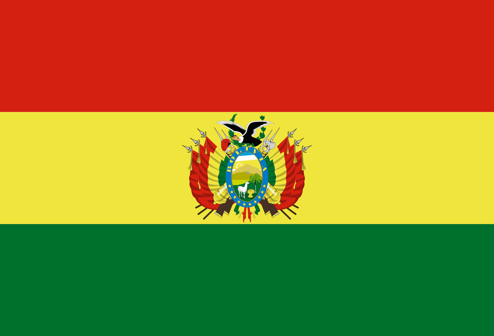

1. **Free Voices Helpline**
   - [More Info](http://www.voceslibresbolivia.org/atencion-a-victimas-de-violencia.html)
   - Phone: +591 4 444 6652
1. **Police Special Unit Helpline**
   - [More Info](https://www.facebook.com/Fuerza-Especial-de-Lucha-Contra-La-Violencia-La-Paz-107240650702618/)
   - Phone: 800 140 348

---

## Brazil

1. **Violence Against Women Helpline**
   - [More Info](https://www.gov.br/pt-br/servicos/denunciar-e-buscar-ajuda-a-vitimas-de-violencia-contra-mulheres)
   - Phone: 180
1. **Instituto Cia dos Sonhos**
   - [More Info](https://institutociadossonhos.ong.br/)
   - Phone: 11 2079 7458

---

## Canada
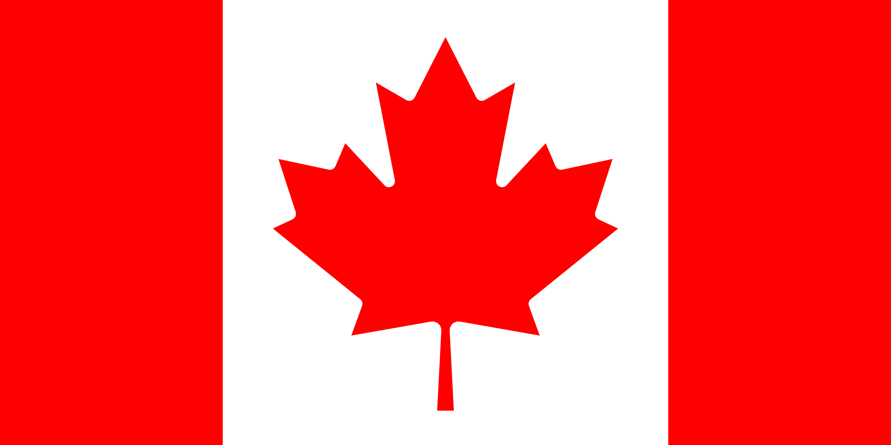

1. **Assaulted Women’s Helpline**
   - Phone: 1-866-863-0511

---

## Chile

1. **Carabineros Family DV Phone**
   - [More Info](https://www.chileatiende.gob.cl/fichas/28630-fono-familia-149?fbclid=IwAR0ZWRFxrVciDTzPRYuPf9fqzgwsob4Ps465ZHJOjpHKn-8qQ2POLYt6yzY)
   - Phone: 149
1. **Violence Against Women Helpline**
   - [More Info](https://www.sernameg.gob.cl/?page_id=26815)
   - Phone: 1455

---

## Colombia
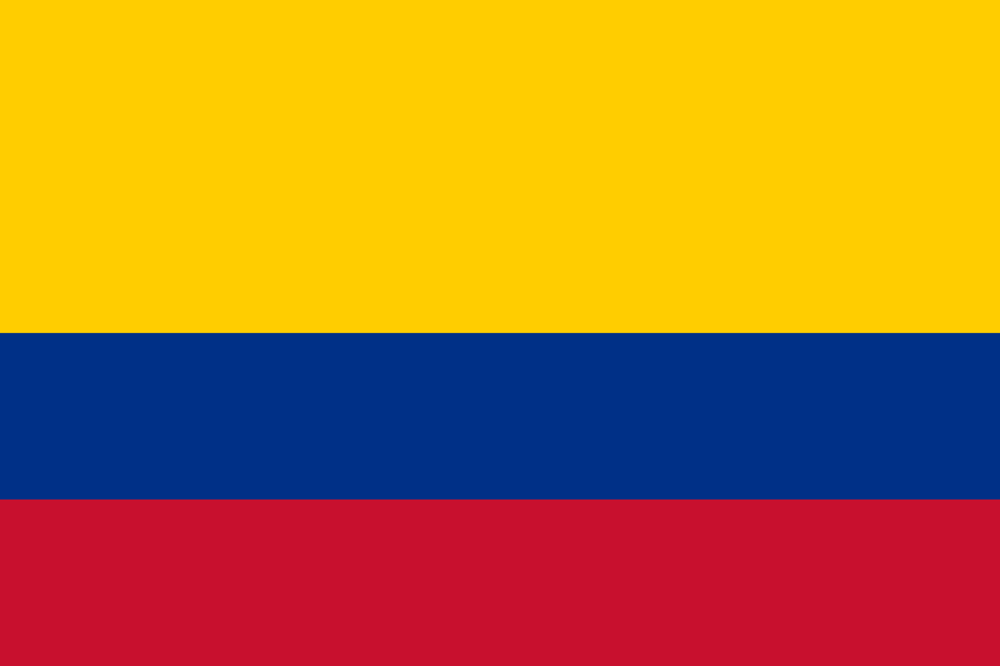

1. **National Violence Against Women Helpline**
   - [More Info](http://www.equidadmujer.gov.co/consejeria/Paginas/linea-155.aspx)
   - Phone: 155

---

## Costa Rica

1. **Victim Support**
   - [More Info](https://ministeriopublico.poder-judicial.go.cr/index.php/atencion-y-proteccion-a-la-victima)
   - Phone: 2295 3000

---

## Cuba

1. **Line 103 for victims of gender violence**
   - [More Info](http://www.redsemlac-cuba.net/?s=103&submit=Search)
   - Phone: 103
1. **Federation of Cuban Women**
   - [More Info](https://www.facebook.com/FMCdeCuba/?locale=es_LA)
   - Phone: + 53 7 838 3540 or 7 838 3541 or 7 838 3542

---

## Dominica

1. **Lifeline Dominica**
   - [More Info](https://www.lifelinedominica.org/)
   - Phone: 767 235 8367 or 767 275 8367
1. **Gender Affairs Helpline**
   - [More Info](http://genderaffairs.gov.dm/contact-us)
   - Phone: 266 3083 or 3344 or 3023

---

## Dominican Republic

1. **Women's Emergency 24 Hr Helpline**
   - [More Info](https://www.facebook.com/MMujerRD)
   - Phone: *212 or 809 200 7212

---

## Ecuador

1. **DELITO**
   - [More Info](https://cepamgye.org/orientacion-para-casos-de-violencia-hacia-las-mujeres-e-integrantes-del-nucleo-familiar-durante-la-emergencia-por-el-virus-del-covid-19/)
   - Phone: 1800 335 486
1. **CEPAM**
   - [More Info](https://cepamgye.org/centro-de-atencion-integral/)
   - Phone: 0991 113 526

---

## El Salvador

1. **ISDEMU 24 hours Women's Help Line**
   - [More Info](https://126teorienta.gob.sv/)
   - Phone: 126
1. **CEMUJER Violence Against Women Helpline**
   - [More Info](https://www.facebook.com/cemujer.el.salvador)
   - Phone: +503 2275 7563

---

## Grenada

1. **Domestic violence Victims Unit**
   - [More Info](https://www.gov.gd/index.php/resident/emergency-services)
   - Phone: 411
1. **GBV Helpline**
   - [More Info](https://www.facebook.com/ServiceMinistry/)
   - Phone: +473 417 6167

---

## Guatemala
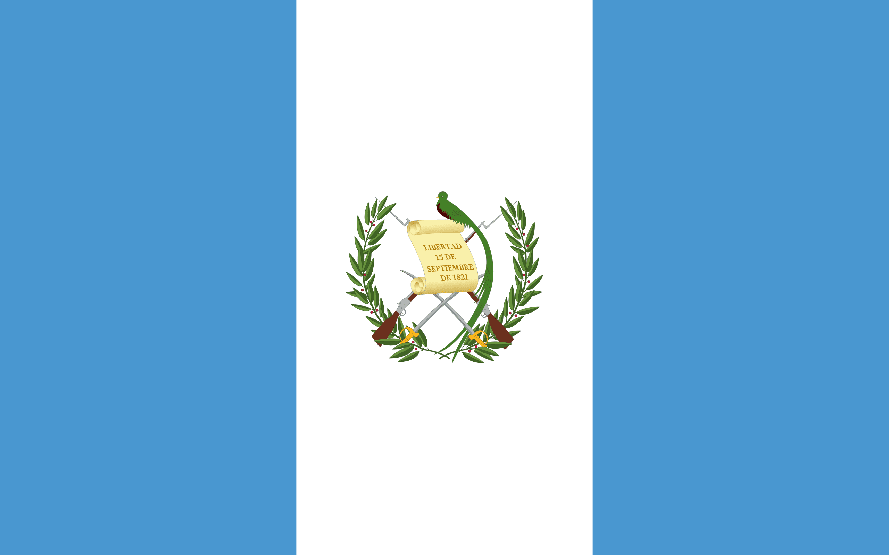

1. **CICAM Women's Support Center**
   - [More Info](http://www.cicam.org.gt/)
   - Phone: +502 2439 8631

---

## Guyana
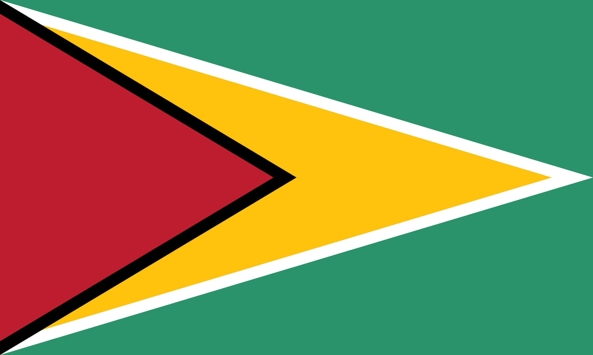

1. **Help and Shelter 24 Hour Hotline**
   - [More Info](https://www.hands.org.gy/index.php?q=about)
   - Phone: +592 227 34 54 or 225 47 31
1. **Emergency GBV Hotline**
   - [More Info](https://mhsss.gov.gy/)
   - Phone: 914

---

## Haiti
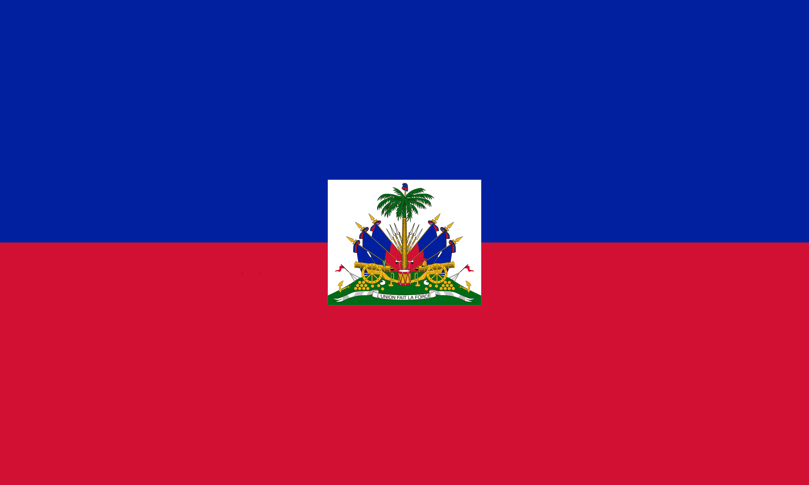

1. **Kay Fanm Telephone**
   - [More Info](https://www.facebook.com/KayFanm/)
   - Phone: *322 (Digicel) or 4041 8308 (Natcom)

---

## Honduras

1. **Women Live Without Fear Helpline**
   - [More Info](https://www.facebook.com/p/Linea-1-1-4-Mujer-Vivir-Sin-Miedo-61554311192078/)
   - Phone: 114
1. **Womens Rights Centre Tegucigalpa**
   - [More Info](http://derechosdelamujer.org/)
   - Phone: +504 22 21 04 59

---

## Jamaica

1. **Ministry of Gender Abuse 24-hour hotline**
   - [More Info](https://www.facebook.com/MCGESJamaica/posts/3698026913553154)
   - Phone: +876 553 0372 and +876 929 2997

---

## Mexico

1. **National 24 Hr Violence against Women Hotline**
   - [More Info](https://salud.edomex.gob.mx/isem/mujeres_situacion_violencia)
   - Phone: 800 108 4053
1. **Citizen Council for Security and Justice Helpline**
   - [More Info](https://consejociudadanomx.org/index.php)
   - Phone: 55 5533-5533

---

## Nicaragua

1. **Ministry for the Family Helpline**
   - [More Info](https://www.mifamilia.gob.ni/somos-mi-familia/)
   - Phone: 2222 4444 or WhatsApp 8352 5121

---

## Panama

1. **Social assistance line**
   - [More Info](https://www.facebook.com/profile/100064531549255/search/?q=147)
   - Phone: 147
1. **Police Violence report helpline**
   - [More Info](https://www.facebook.com/PNPma/posts/3519708931378600/)
   - Phone: 104 or 511 9201

---

## Paraguay

1. **SOS Mujeres Gender Violence Support Line**
   - [More Info](https://mujer.gov.py/atencion-a-la-mujer/)
   - Phone: 137
1. **Women's Attention Service (SEDAMUR) for comprehensive care**
   - [More Info](https://mujer.gov.py/atencion-a-la-mujer/)
   - Phone: 021 45 20 60

---

## Peru

1. **National Family and Sexual Violence Helpline**
   - [More Info](https://www.gob.pe/481-ayuda-contra-la-violencia-familiar-y-sexual-linea-100)
   - Phone: 100
1. **The Urgent Care Service**
   - [More Info](https://www.gob.pe/484-denunciar-violencia-familiar-y-sexual-servicio-de-atencion-urgente)
   - Phone: 41 97 260

---

## Saint Kitts and Nevis

1. **Department of Gender Affairs Hotline**
   - [More Info](https://socialdevelopment.gov.kn/gender-affairs/)
   - Phone: 765 5492
1. **Ministry of Social Development & Gender Affairs**
   - [More Info](https://www.facebook.com/MCDGASS/)
   - Phone: +1 869 467 1275

---

## Saint Lucia

1. **St Lucia Crisis Centre 24-hour Hotline**
   - [More Info](https://slucrisiscentre.wordpress.com/contact-us/)
   - Phone: +758 453 6848 or +758 712 7574
1. **Womens Support Centre 24 hour toll-free hotline**
   - [More Info](http://education.govt.lc/news/ministry-calls-for-swifter-review-and-enactment-of-laws-against-gender-based-violence)
   - Phone: 202

---

## St. Vincent & the Grenadines

1. **Gender Affairs Division**
   - [More Info](https://www.prod.facebook.com/GenderAffairsDivisionSVG/)
   - Phone: +784 453 2061 or +784 456 7949
1. **Police Emergency Numbers**
   - [More Info](http://www.rsvgpf.gov.vc/rsvgpf/index.php/about-us/contact-us)
   - Phone: +784 456 1750

---

## Suriname

1. **STICRIS women's shelter**
   - [More Info](https://sticris.com/hulpverlening/)
   - Phone: +597 404 228
1. **Women's Rights Centre**
   - [More Info](https://wrcsuriname.org/contact/)
   - Phone: +597 550 508 or +597 520 916

---

## Trinidad and Tobago

1. **National Domestic Violence Abuse Hotline**
   - [More Info](http://www.opm-gca.gov.tt/Contact/ContactInformation)
   - Phone: +868 800SAVE or 800 7283
1. **Coalition Against Domestic Violence**
   - [More Info](https://coalitionagainstdomesticviolence.org/)
   - Phone: +868 624 0402

---

## Turks and Caicos Islands

1. **Department of Gender Affairs**
   - [More Info](https://www.gov.tc/genderaffairs/)
   - Phone: 649 338 2681
1. **Human Rights Commission**
   - [More Info](https://www.gov.tc/hrc/)
   - Phone: 649 941 5343

---

## United States of America

1. **National 24 Hrs Domestic Violence Hotline**
   - [More Info](https://www.thehotline.org/)
   - Phone: 1 800 799 7233 or TTY 18007873224
1. **National Special Victims (NSV)**
   - [More Info](https://specialvictims.org/)
   - Phone: 888 805 0122

---

## Uruguay
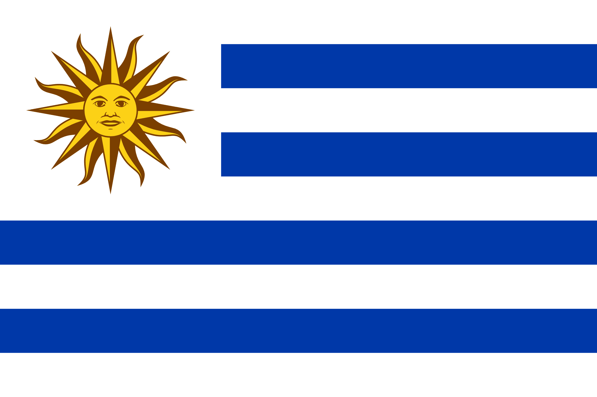

1. **Telephone counseling service for women in situations of Domestic Violence**
   - [More Info](http://guiaderecursos.mides.gub.uy/66589/servicio-telefonico-y-ayuda-a-mujer-en-situacion-de-violencia-domestica-0800-4141)
   - Phone: 0800 4141
1. **Casa de la Mujer**
   - [More Info](https://www.casadelamujer.org.uy/mujer/violencia-genero/item/horarios-violencia-domestica.html)
   - Phone: 2506 06 01 or 2507 36 14

---

## Venezuela
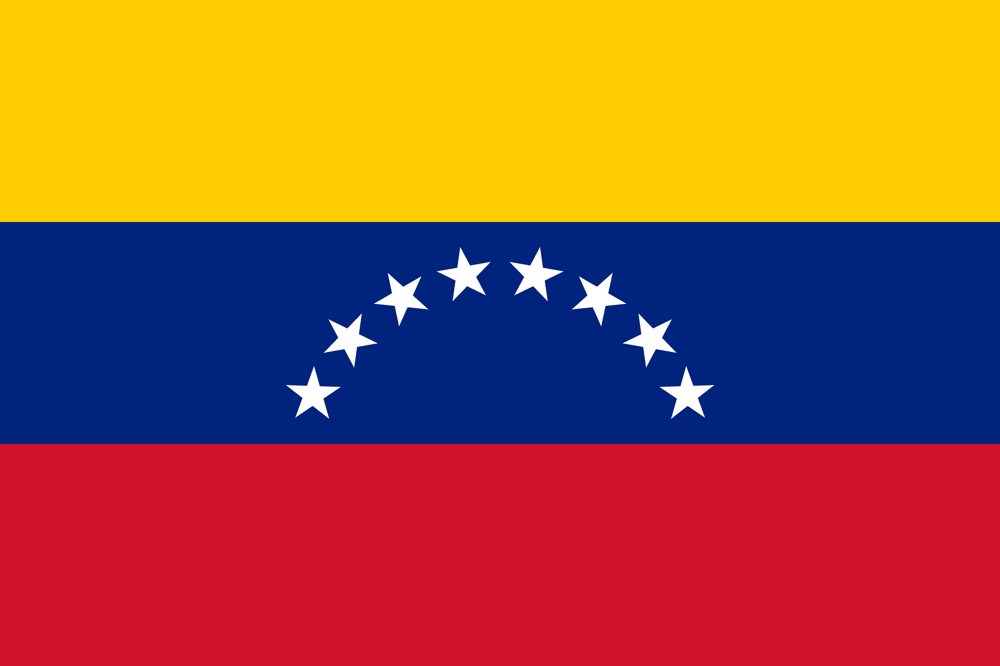

1. **GBV Hotline**
   - [More Info](http://www.inamujer.gob.ve/index.php/atencion-integral-y-prevencion-de-la-violencia-contra-las-mujeres/)
   - Phone: 0800 685 37 37 or *112 from Movilnet

---

## Albania

1. **The Women and Girls Advice Line**
   - [More Info](http://www.hotlinealbania.org/)
   - Phone: 116 117 or 042 233 408
1. **Gruaja tek Gruaja (Women to Women)**
   - [More Info](https://gtg.al/kontakto/)
   - Phone: +355 69 609 0527

---

## Andorra

1. **Social Affairs Helpline**
   - [More Info](https://www.aferssocials.ad/igualtat)
   - Phone: 181
1. **Stop Violencies**
   - [More Info](https://stopviolencies.wixsite.com/stopviolencies?fbclid=IwAR0B2KkaI2Wo96ukB6j7A3DiACPJV_TwhDEMX2b7okvSmwiCmA3BCb0Y8X4)
   - Phone: +376 64 64 64 or 34 67 21

---

## Armenia

1. **Women's Support Center Hotline and Shelters**
   - [More Info](https://www.womensupportcenter.org/)
   - Phone: 099 88 78 08
1. **Womens Rights Center Hotline**
   - [More Info](https://www.facebook.com/WRC.Armenia)
   - Phone:  010 54 28 28

---

## Austria

1. **Women’s Helpline against Violence**
   - [More Info](http://www.frauenhelpline.at/)
   - Phone: 43 800 222 555
1. **Victim Support emergency number**
   - [More Info](https://www.weisser-ring.at/kontakt/)
   - Phone: 0800 112 112

---

## Azerbaijan
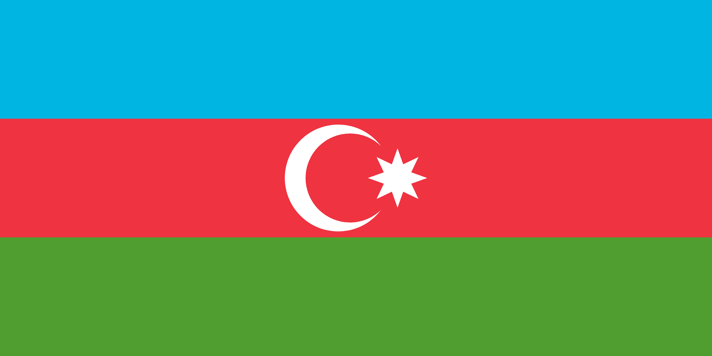

1. **The State Committee for Family, Women and Children Affair (SCFWCA)**
   - [More Info](https://family.gov.az/en/pages/860-destek-xetti)
   - Phone: 860 or +99412 498 00 92

---

## Belarus

1. **Belarus Womens Foundation**
   - [More Info](https://belaruswomen.org/en/)
   - Phone: By email: helpline@belaruswomen.org

---

## Belgium
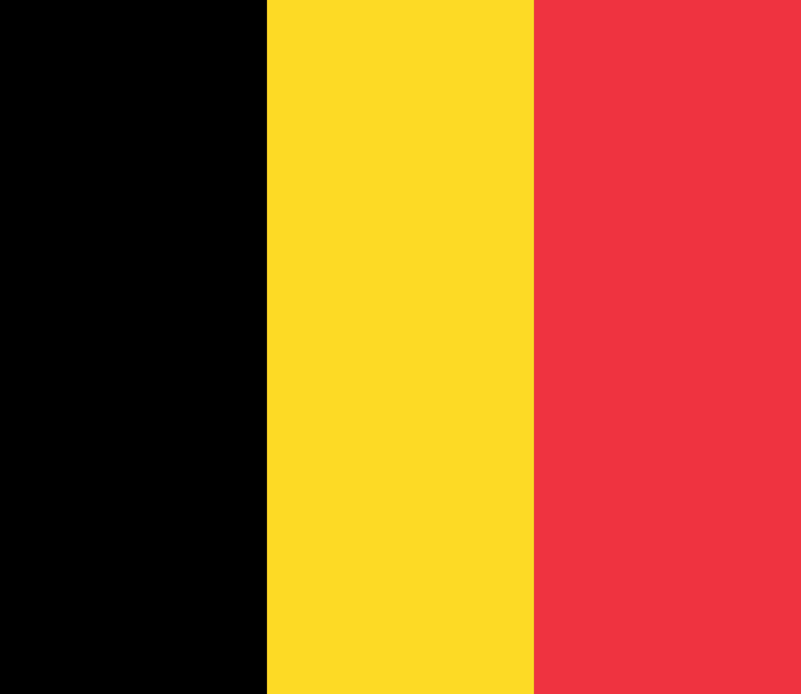

1. **Ecoutes Violences Conjugales (for marital violence)**
   - [More Info](https://www.ecouteviolencesconjugales.be/)
   - Phone: 0800 300 30
1. **Violence and Abuse Helpline**
   - [More Info](https://1712.be/home)
   - Phone: 1712

---

## Bosnia and Herzegovina

1. **24 Hr SOS RED LINE**
   - [More Info](https://fld.ba/en/services/sos)
   - Phone: 033 222 000
1. **SOS Line for Help of Women and Children**
   - [More Info](https://www.stopvawnow.org/en/help)
   - Phone: 1265 (or 1264 in Republika Srpska)

---

## Bulgaria

1. **Demetra Psychological telephone line for crisis services**
   - [More Info](https://demetra-bg.org/)
   - Phone: 0700 40 150
1. **SOS-Families at Risk Foundation**
   - [More Info](https://www.facebook.com/%D0%A4%D0%BE%D0%BD%D0%B4%D0%B0%D1%86%D0%B8%D1%8F-SOS-%D1%81%D0%B5%D0%BC%D0%B5%D0%B9%D1%81%D1%82%D0%B2%D0%B0-%D0%B2-%D1%80%D0%B8%D1%81%D0%BA-443886810267/)
   - Phone: +359 (0) 52/609 677

---

## Croatia

1. **Women's Help Now SOS**
   - [More Info](http://zenskapomocsada.hr/)
   - Phone: 0800 655 222
1. **IZVOR SOS Helpline for victims of GBV**
   - [More Info](http://www.zenska-udruga-izvor.hr/)
   - Phone: 0800 200 151

---

## Cyprus

1. **SPAVO Helpline**
   - [More Info](https://domviolence.org.cy/)
   - Phone: 1440
1. **Police Citizens Line**
   - [More Info](https://www.police.gov.cy/police/police.nsf/All/C07DAD4D055DD8B0C22583F90045B9D3)
   - Phone: 1460

---

## Czech Republic

1. **Victim Support Crisis Line**
   - [More Info](https://www.116006.cz/)
   - Phone: 116 006

---

## Denmark
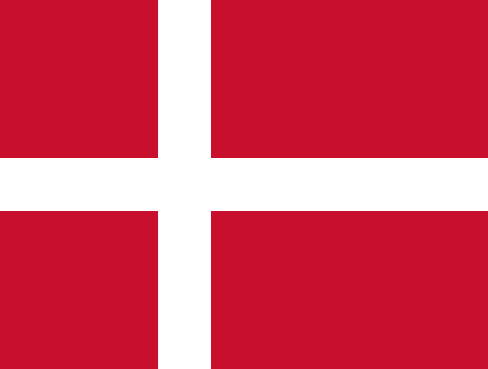

1. **Live Without Violence National DV Hotline**
   - [More Info](https://levudenvold.dk/hjaelp-og-radgivning/national-hotline/)
   - Phone: 1888
1. **Randers Crisis Centre**
   - [More Info](https://krisecenter.randers.dk/randers-krisecenter/)
   - Phone: 89 15 49 90

---

## Estonia

1. **ENVL (Eesti Naiste Varjupaikade Liit - Estonian Women's Shelter Association) 24 Hour Toll Free Helpline Tugitelefon**
   - [More Info](http://www.naisteliin.ee/index.php?id=115)
   - Phone: 1492
1. **Victim Support Crisis Line**
   - [More Info](https://www.palunabi.ee/)
   - Phone: 116006

---

## Faroe Islands

1. **Kvinnuhusio Women's hotline**
   - [More Info](https://kvinnuhusid.fo/)
   - Phone: 317200

---

## Finland
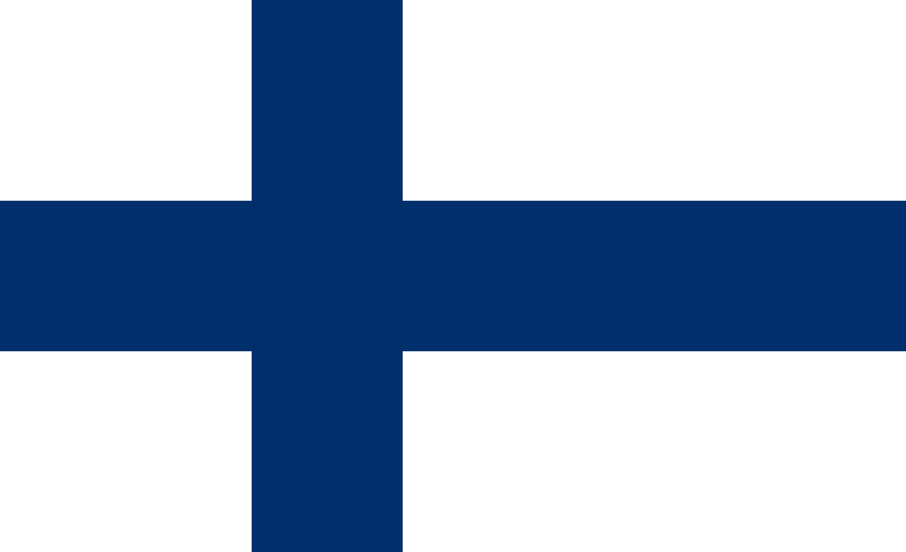

1. **The Women's Line (Naisten Linja)**
   - [More Info](https://naistenlinja.fi/etsitko-tukipalveluita)
   - Phone: +358 8000 2400
1. **Victim Support Finland**
   - [More Info](https://www.riku.fi/palvelut/rikosuhripaivystys-116-006/)
   - Phone: 116006

---

## France

1. **Solidaritie Femmes Info Helpline**
   - [More Info](https://solidaritefemmes.org/appeler-le-3919/)
   - Phone: 3919

---

## Georgia

1. **National Womens Helpline**
   - [More Info](http://www.ginsc.net/home.php?cat=0&sub=0&mode=100&lang=en)
   - Phone: 116006
1. **Ministry of Internal Affairs Domestic Violence Hotline**
   - [More Info](https://www.humanrightsguide.ge/en/themes/domestic-violence/help-and-assistance/social-and-psychological-assistance)
   - Phone: 2 309 903

---

## Germany

1. **24 Hr Violence Against Women Helpline**
   - [More Info](https://www.hilfetelefon.de/)
   - Phone: 116006
1. **BIG Hotline**
   - [More Info](https://www.big-hotline.de/)
   - Phone: +49 (0) 30 - 611 03 00

---

## Gibraltar
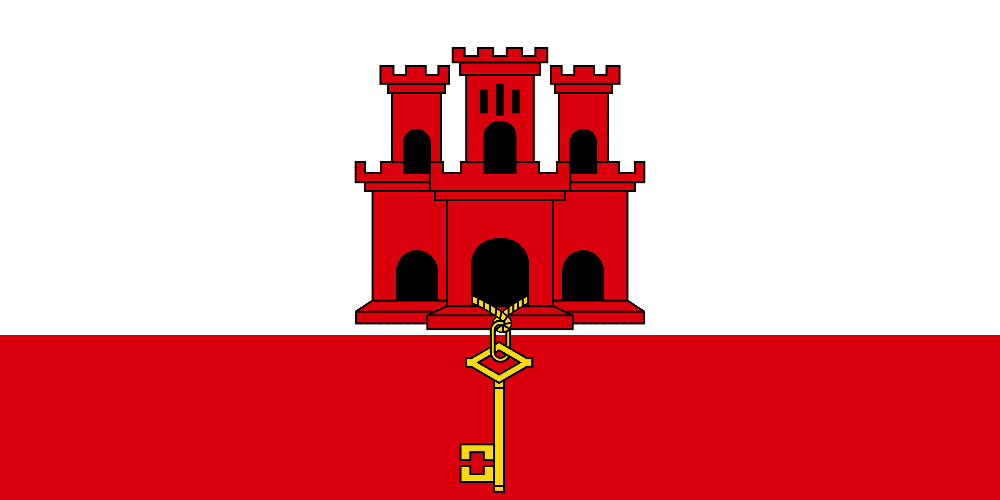

1. **Women in Need helpline**
   - [More Info](https://www.facebook.com/125468304189157/posts/srgeurope-are-proud-to-be-supporting-women-in-need-gibraltar-for-the-2nd-year-ru/3537641722971781/)
   - Phone: 8018 or +350 200 425 81

---

## Greece

1. **SOS line "Next to you" against domestic violence**
   - [More Info](http://enowhumanrights.gr/)
   - Phone: 302109700814
1. **National SOS Helpline**
   - [More Info](http://www.isotita.gr/)
   - Phone: 15900

---

## Greenland
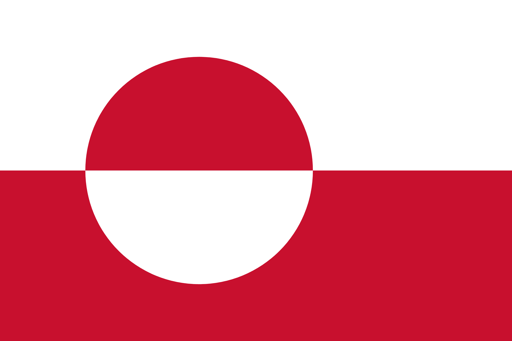

1. **Greenland Police Call Center**
   - [More Info](https://politi.gl/anmeld/om-at-anmelde)
   - Phone: 701448

---

## Guernsey
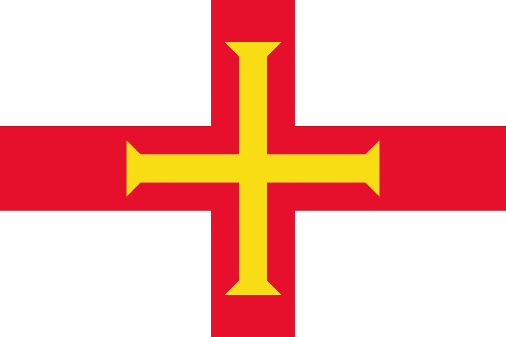

1. **UK National Domestic Violence Helpline**
   - [More Info](https://www.nationaldahelpline.org.uk/)
   - Phone: 0808 2000 247
1. **Safer 24/7 helpline**
   - [More Info](http://www.safer.gg/)
   - Phone: +44 (0)1481 721 999

---

## Hungary
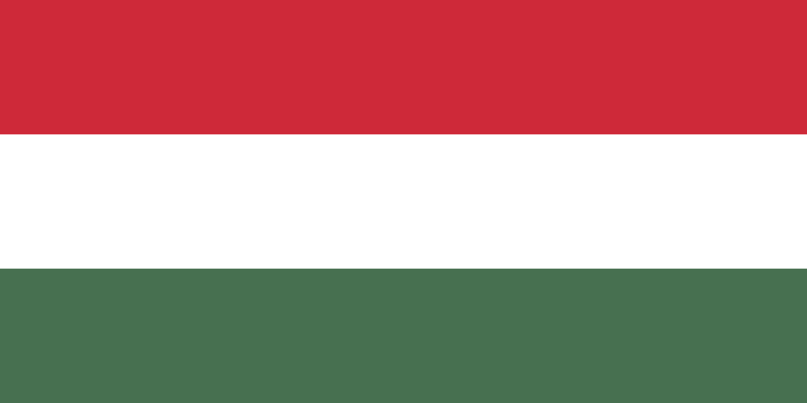

1. **24 Hour OKIT National Crisis Helpline**
   - [More Info](https://nane.hu/erintetteknek/hol-kaphatok-segitseget/)
   - Phone:  0-24 or 06 80 20 55 20
1. **Victim Support**
   - [More Info](https://vansegitseg.hu/)
   - Phone: 06 80 225 225

---

## Iceland
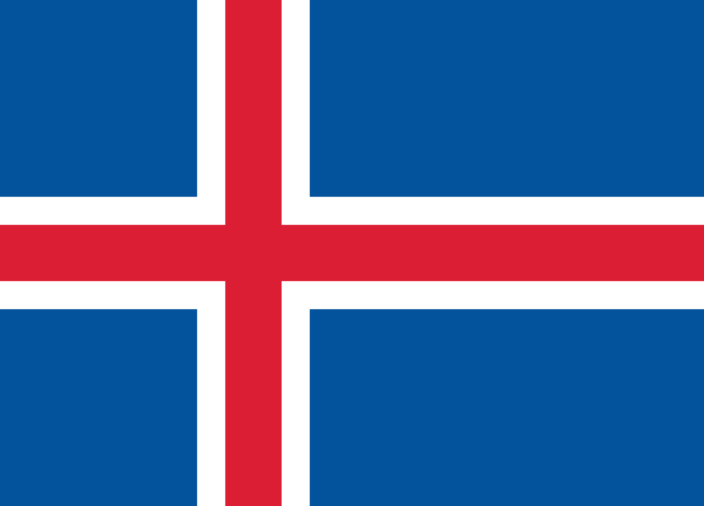

1. **Kvennaathvarfið/The Women’s Shelter Helpline**
   - [More Info](https://www.kvennaathvarf.is/where-can-i-get-help/?lang=en)
   - Phone: 561 1205
1. **Bjarkarhl centre for victims of violence**
   - [More Info](https://www.bjarkarhlid.is/)
   - Phone: 553 3000

---

## Ireland

1. **National Freephone Helpline**
   - [More Info](https://www.womensaid.ie/services/helpline.html)
   - Phone: 1800 341 900
1. **Victim Support Helpline**
   - [More Info](https://www.crimevictimshelpline.ie/)
   - Phone: 116006

---

## Italy

1. **Telefona Rosa 24 Hrs (Pink Telephone) Violence Helpline**
   - [More Info](https://www.telefonorosa.it/)
   - Phone: 06 375 18 282
1. **Violence and Stalking 24 Hr Helpline (Numero Gratuito Antiviolenza e Antistalking)**
   - [More Info](https://www.1522.eu/)
   - Phone: 1522

---

## Jersey

1. **Jersey Womens Refuge 24-hour helpline**
   - [More Info](https://jerseywomensrefuge.org/)
   - Phone: 0800 735 6836
1. **Victim First Helpline**
   - [More Info](https://www.victimsfirst.je/)
   - Phone: 0800 7351612

---

## Kosovo

1. **Police Helpline for victims of DV**
   - [More Info](https://www.facebook.com/oscekosovo/photos/2608887019375819)
   - Phone: 0800 19 999
1. **Victims Advocacy and Assistance Office (VAAO) Toll Free 24 Hour Helpline**
   - [More Info](https://prokuroria-rks.org/en/ask-for-help/)
   - Phone: 0800 11 112

---

## Latvia
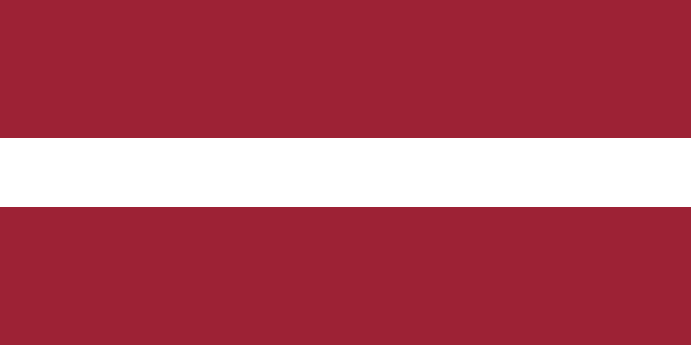

1. **Skalbes 24 Hour Crisis Helpline**
   - [More Info](https://www.skalbes.lv/)
   - Phone: 116 123 or +371 67 222 922
1. **Pasparne 24 hours Family Crisis Center**
   - [More Info](https://www.kc-pasparne.lv/)
   - Phone: +371 63 661 515

---

## Liechtenstein

1. **Women's Helpline Frauenhaus Liechtenstein**
   - [More Info](https://www.frauenhaus.li/)
   - Phone: +423 380 02 03
1. **Victim Support**
   - [More Info](https://www.llv.li/inhalt/11484/amtsstellen/opferhilfestelle)
   - Phone: +423 236 76 96

---

## Lithuania

1. **SKPC Helpline**
   - [More Info](https://www.specializuotospagalboscentras.lt/)
   - Phone:  8 700 55516
1. **24 Hour Helpline for Women**
   - [More Info](https://pagalbosmoterimslinija.lt/)
   - Phone: 8 800 66366

---

## Luxembourg

1. **DV Helpline**
   - [More Info](http://www.helpline-violence.lu/)
   - Phone: 20601060
1. **Fraenhaus Leitzebuerg Helpline**
   - [More Info](https://fed.lu/wp/services/fraenhaus/)
   - Phone: 448181

---

## Madeira

1. **Social Emergency Line**
   - [More Info](https://www.procivmadeira.pt/pt/)
   - Phone: 144
1. **Civil Protection service**
   - [More Info](https://www.procivmadeira.pt/pt/contactos.html)
   - Phone: 291 700 112/5

---

## Malta

1. **Women's Appogg Agency Support line**
   - [More Info](https://family.gov.mt/public-bodies/foundation-for-social-welfare-services/)
   - Phone: 179
1. **Police Victim Support Unit**
   - [More Info](https://pulizija.gov.mt/en/victim-support/)
   - Phone: 2294 2160

---

## Moldova
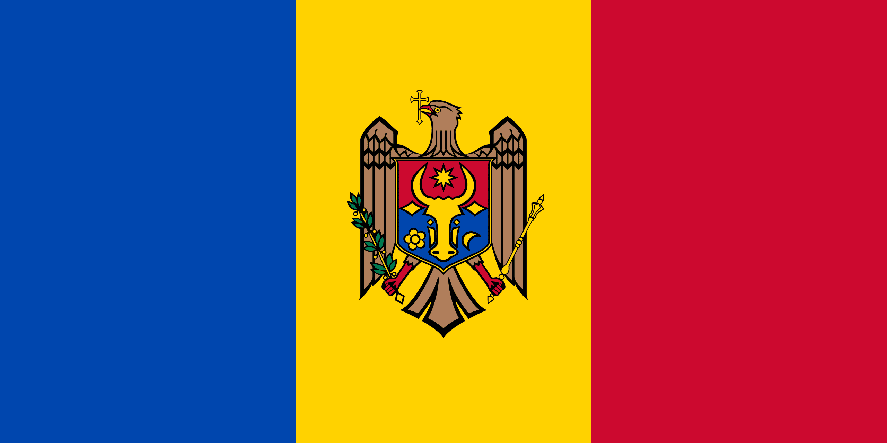

1. **La Strada Helpline for Women**
   - [More Info](http://lastrada.md/rom/telefoane-utile)
   - Phone: 0 8008 8008

---

## Monaco

1. **Victims of Violence Helpline**
   - [More Info](https://en.gouv.mc/Portail-du-Gouvernement/Policy-Practice/Social-Affairs-and-Health/News/A-New-Information-Number-for-Victims-of-Violence-0800-91-90-10)
   - Phone: 0800 91 90 10
1. **Victim Support (AVIP)**
   - [More Info](https://www.avip-monaco.org/en/)
   - Phone: +377 93 25 00 07

---

## Montenegro

1. **SOS hotline for victims of domestic violence**
   - [More Info](https://medicazenica.org/)
   - Phone: 1265

---

## Netherlands

1. **National domestic violence helpline**
   - [More Info](https://www.veiligthuisoostbrabant.nl/)
   - Phone: 0800 2000
1. **24 Hour DV Helpline**
   - [More Info](https://www.blijfgroep.nl/kennisbank/hulpvraag/)
   - Phone: 088 234 24 50

---

## North Macedonia

1. **Women's National Help Line**
   - [More Info](https://www.facebook.com/crisiscenterhope/)
   - Phone: 15 315
1. **Free SOS hotline for victims of domestic violence**
   - [More Info](http://www.sozm.org.mk/index.php?option=com_content&view=article&id=1&Itemid=5&lang=mk)
   - Phone: 141 700

---

## Norway

1. **24 Hours DV Helpline**
   - [More Info](https://www.volinjen.no/)
   - Phone: 116 006

---

## Poland

1. **National 24/7 Emergency Service for Survivors of Family Violence (Blue Line)**
   - [More Info](https://www.niebieskalinia.pl/pomoc/opopp/6620-bezplatna-pomoc-dla-osob-pokrzywdzonych-przestepstwem-swiadkow-przestepstw-oraz-czlonkow-ich-rodzin-2020)
   - Phone: 116 123 or 22 668 70 00
1. **Women's Rights Center Foundation 24/7 nationwide hotline**
   - [More Info](https://cpk.org.pl/pomoc-w-czasie-pandemii/)
   - Phone: 600 07 07 17

---

## Portugal
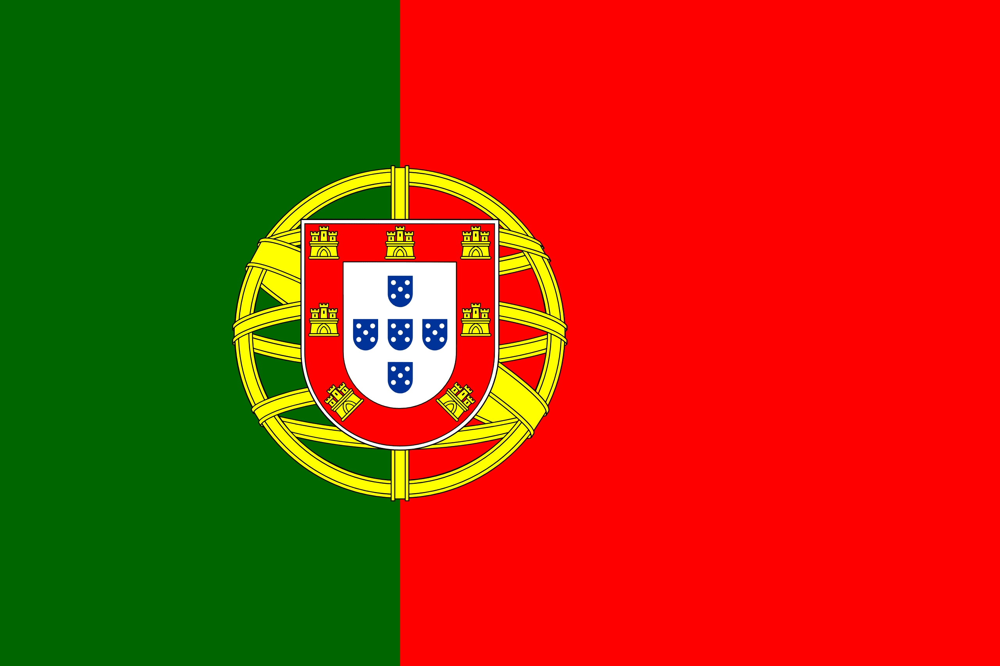

1. **Domestic Violence Helpline**
   - [More Info](https://www.cig.gov.pt/servicos/servico-de-informacao-as-vitimas-de-violencia-domestica/)
   - Phone: 800 202 148

---

## Romania

1. **Toll-free 24 hour hotline for domestic and sexual violence support**
   - [More Info](https://anes.gov.ro/informatii-utile-pentru-victime/)
   - Phone: 0800 500 333

---

## Russia

1. **All Russia 24 Hour Helpline**
   - [More Info](https://www.facebook.com/anna.center.ru/)
   - Phone: 8-800 7000 600
1. **Telephone of Trust Helpline**
   - [More Info](https://krizis-centr.ru/about/telefon-doveriya)
   - Phone: (499) 977 20 10 or (499) 492 46 89

---

## San Marino

1. **National Helpline for Anti-Violence and Stalking**
   - [More Info](https://www.1522.eu/cose-1522/?lang=en)
   - Phone: 1522

---

## Serbia

1. **SOS DV Report to Police**
   - [More Info](https://www.rs.undp.org/content/serbia/en/home/presscenter/articles/2020/16-days-tice-me-se-.html)
   - Phone: 0800 100 600
1. **SOS hotline for women with experience of violence**
   - [More Info](http://zvecanska.org.rs/?page_id=4111)
   - Phone: 0800 222 003

---

## Slovakia
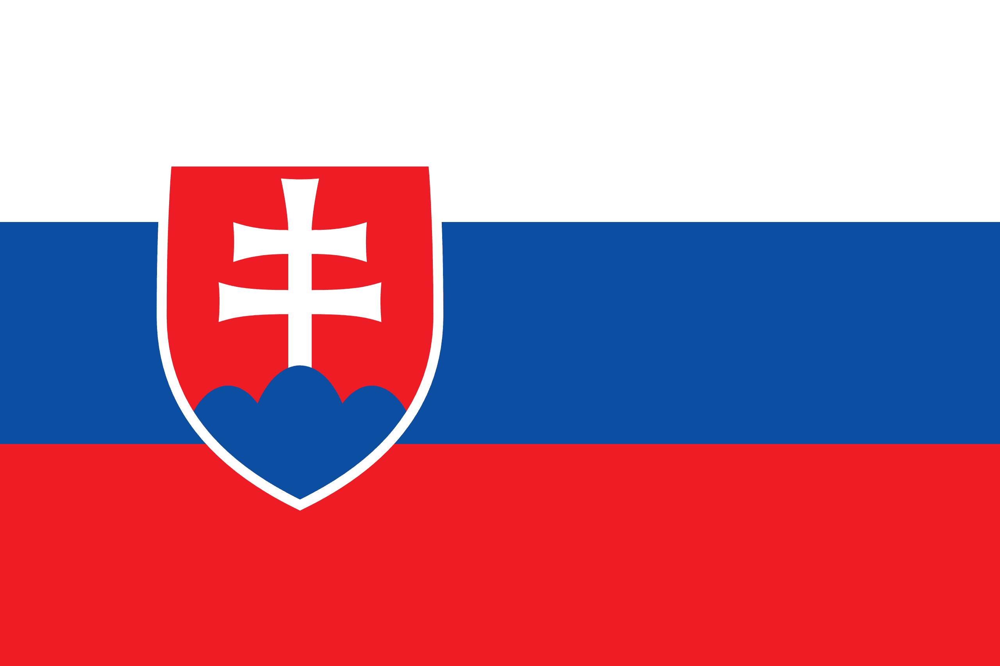

1. **24 Hour Crisis Helpline**
   - [More Info](https://alianciazien.wordpress.com/)
   - Phone: +421 0903 519 550
1. **24 Hour Domestic Violence hotline**
   - [More Info](https://www.zastavmenasilie.gov.sk/rady-pre-zenu/)
   - Phone: 0800 212 212

---

## Slovenia
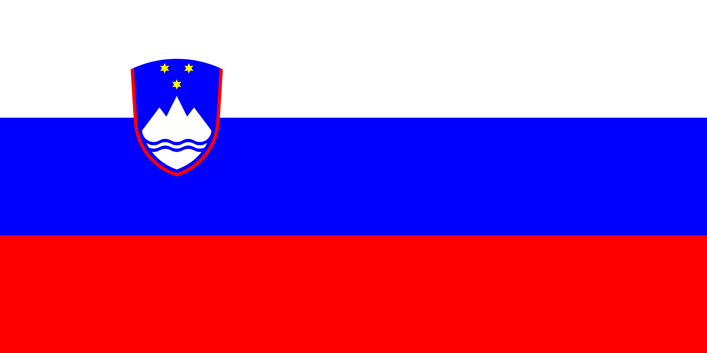

1. **EMMA Helpline**
   - [More Info](http://zavod-emma.si/programi-pomoci/)
   - Phone: 080 21 33

---

## Spain

1. **National 24 Hour Gender Violence Helpline**
   - [More Info](https://violenciagenero.igualdad.gob.es/informacionUtil/recursos/telefono016/home.htm)
   - Phone: 016
1. **Family and Women Care Units (Police)**
   - [More Info](https://www.policia.es/_es/colabora_ufam.php)
   - Phone: 091

---

## Sweden

1. **ROKS (National Organisation for Women's Shelters in Sweden)**
   - [More Info](https://www.roks.se/)
   - Phone: 08 442 99 30
1. **National Women's Helpline**
   - [More Info](https://kvinnofridslinjen.se/en/)
   - Phone: 020 50 50 50

---

## Switzerland

1. **Sexual and Domestic Violence Helpline**
   - [More Info](https://www.frauenberatung.ch/wir-ueber-uns/kontakt/index.html)
   - Phone: 044 291 46 46
1. **AVVEC hotline for victims of domestic violence**
   - [More Info](https://www.avvec.ch/fr/trouver-de-laide)
   - Phone: 022 797 10 10

---

## Ukraine

1. **24/7 National Gender Based Violence Hotline**
   - [More Info](https://la-strada.org.ua/garyachi-liniyi)
   - Phone: 0 800 500 335 or 116 123 (from mobile)
1. **Government Hotline for victims of domestic and gender based violence**
   - [More Info](https://minre.gov.ua/en/government-hotlines/government-hotlines-help-ministry-of-social-policy/)
   - Phone: 1547

---

## United Kingdom

1. **All UK: National 24 Hour Domestic Violence Helpline**
   - [More Info](https://www.nationaldahelpline.org.uk/)
   - Phone: 0808 2000 247
1. **Emergency Services**
   - [More Info](https://www.met.police.uk/contact/how-to-make-a-silent-999-call)
   - Phone: 999

---

## Australia

1. **National Sexual Assault, Family & Domestic Violence Line**
   - [More Info](https://www.1800respect.org.au/)
   - Phone: 1800 737 732

---

## Fiji

1. **Helpline**
   - [More Info](http://www.fijiwomen.com/)
   - Phone: 1560 or 331 3300 or Mobile: 920 9470

---

## Kiribati
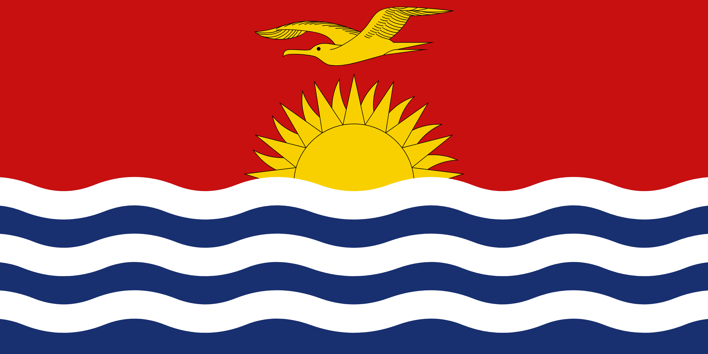

1. **Kiribati Women and Children Support Centre (KWCSC) Helpline**
   - [More Info](https://asiapacific.unwomen.org/en/news-and-events/stories/2018/02/more-support-for-kiribati-women-and-children)
   - Phone: 191 or 750 21 000

---

## Marshall Islands

1. **Women United Together Marshall Islands**
   - [More Info](https://www.wutmi.com/)
   - Phone: +692 625 5290

---

## Micronesia

1. **Chuuk Women's Council**
   - [More Info](https://www.facebook.com/chuukwomenscouncil/)
   - Phone: (691) 330 5263 or 330 8397

---

## Nauru
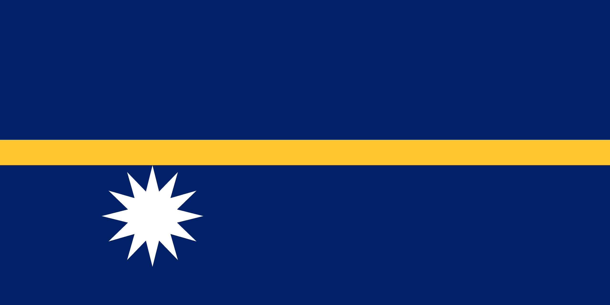

1. **Police DV Unit**
   - [More Info](https://www.facebook.com/NauruPoliceForce/posts/283434316485785)
   - Phone: 557 9014 or 557 9024
1. **Women's Affairs Department**
   - [More Info](https://www.facebook.com/watch/?v=251273916364714)
   - Phone: 248

---

## New Zealand

1. **Women's Crisis Line**
   - [More Info](https://womensrefuge.org.nz/)
   - Phone: 0800 733 843
1. **Shine domestic abuse services**
   - [More Info](https://2shine.org.nz/)
   - Phone: 0508 744 633

---

## Palau

1. **Belau Women's Resource Center**
   - [More Info](https://www.palaugov.pw/belau-womens-resource-center/)
   - Phone: +680 767 2452

---

## Papua New Guinea

1. **24-hour Lae Police Emergency**
   - [More Info](https://femilipng.org/resources/stopping-violence/other-help-available/)
   - Phone: 7090 3300
1. **Femili PNG Family and Sexual Violence Case Management Centre**
   - [More Info](https://www.femilipng.org/contact/)
   - Phone: +675 7091 4027

---

## Samoa

1. **Faataua Le Ola Samoa Lifeline**
   - [More Info](https://www.facebook.com/FLOsamoalife/)
   - Phone: 800 5433
1. **Samoa Victim Support Group**
   - [More Info](https://www.facebook.com/samoavictimsupportgroup/)
   - Phone: +685 800 7874

---

## Solomon Islands

1. **Family Support Centre, GBV Helpline, Honiara**
   - [More Info](https://solomons.gov.sb/ministry-of-women-youth-children-family-affairs/essential-services/get-emergency-contact-for-victims/)
   - Phone: +677 26 999 or 20 619
1. **Safenet GBV Helpline**
   - [More Info](https://www.facebook.com/SAFENETSolomonIslands/)
   - Phone: 132

---

## Tonga

1. **Women's Crisis Centre Helpline**
   - [More Info](https://www.facebook.com/tongawccc/posts/2372331592827544)
   - Phone: +676 22 240
1. **Tonga National Center for Women and Children**
   - [More Info](https://www.facebook.com/profile.php?id=100064438401760)
   - Phone: +676 26 567

---

## Tuvalu

1. **Family Health Association Helpline**
   - [More Info](https://www.facebook.com/TuvaluFHA)
   - Phone: +688 20 411
1. **Tuvalu Police**
   - [More Info](https://www.facebook.com/tuvalugov/?ref=page_internal)
   - Phone: +688 20 725

---

## Vanuatu
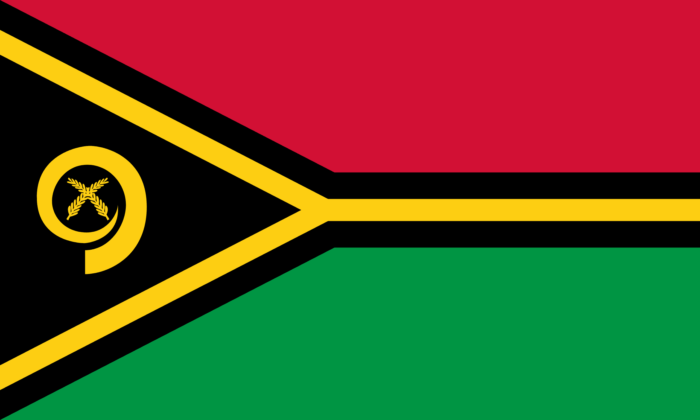

1. **Vanuatu Women's Centre: 24 Hour Crisis Line**
   - [More Info](https://www.facebook.com/vanuatuwomenscentre/)
   - Phone: 161
1. **Family Protection Units, Vanuatu Police Department**
   - [More Info](https://police.gov.vu/what-we-do/safety-security/family-protection/48-family-protection)
   - Phone: Port Villa 22 222 or Santo 36 222

---

